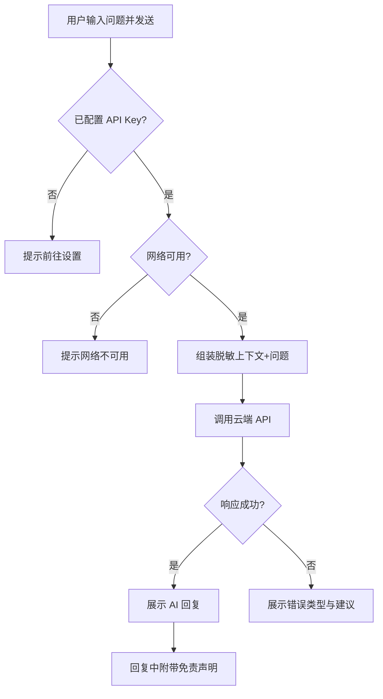

# AI 智能分析 — 菜单需求文档

| 项目 | 内容 |
|------|------|
| 文档名称 | AI 智能分析 — 菜单需求文档 |
| 文档版本 | v1.0 |
| 状态 | 未确认 |
| 确认日期 | — |
| 存放路径 | `docs/current/modules/disk-helper/PRD_AI智能分析.md` |

---

### 功能概述

本页提供**对话式 AI 分析**：用户可就 C 盘文件/目录或清理清单提问，获得「是什么、能否删、有何影响、如何恢复」等自然语言解释。AI 通过**单一可配置云端 API**（在「设置」中配置 Key）调用；上下文由本地组装的**脱敏摘要**构成，不上传文件内容。AI **仅建议，不执行**任何删除。

与兄弟页分工：「空间浏览」「安全清理」可携带选中上下文进入本页；实际清理须在「安全清理」由用户确认执行。

### 角色权限

| 维度 | 说明 |
|------|------|
| 数据权限 | 不适用。对话与上下文均在本机会话内；发送至云端仅为脱敏摘要。 |
| 功能权限 | 个人用户可提问、查看回复、清除会话；须已配置有效 API Key 且网络可用。 |

| 操作 | 个人用户 |
|------|----------|
| 发起提问 | ✓（需 API Key + 网络） |
| 查看 AI 回复 | ✓ |
| 携带浏览/清理上下文 | ✓ |
| 通过 AI 直接删除文件 | — |
| 切换多个 API Provider | —（第一版仅一家） |

### 页面结构

```text
┌────────────────────────────────────────────────────────────────────────┐
│ 主导航：总览 | 浏览 | 清理 | 分析（当前）| 设置                        │
├────────────────────────────────────────────────────────────────────────┤
│ 页标题：AI 智能分析                    [新对话] [清除上下文]            │
├──────────────────────────────┬─────────────────────────────────────────┤
│ 上下文面板（左栏，可折叠）    │ 对话区（右栏）                           │
│                              │ ┌─────────────────────────────────────┐ │
│ 【当前上下文】                │ │ 消息列表（用户 / AI）                │ │
│  - 来源：浏览/清理/无         │ │                                     │ │
│  - 路径摘要列表（脱敏）       │ └─────────────────────────────────────┘ │
│  - 风险等级摘要               │ ┌─────────────────────────────────────┐ │
│                              │ │ 输入框 [发送]  快捷：能删吗|怎么恢复  │ │
│ [编辑上下文] [清空上下文]     │ └─────────────────────────────────────┘ │
└──────────────────────────────┴─────────────────────────────────────────┘
```

- 未配置 API Key 时，对话区展示空状态与「前往设置配置 API Key」链接；输入框 disabled。
- 无网络时，展示「网络不可用，AI 分析暂不可用」横幅；本地上下文面板仍可用。

### 枚举

#### 枚举：上下文来源

| 存储值 | 展示名 | 说明 |
|--------|--------|------|
| none | 无 | 用户自行提问，无携带项 |
| browse | 空间浏览 | 从浏览页选中项带入 |
| cleanup | 安全清理 | 从清理清单带入 |
| manual | 手动添加 | 用户在本页手动添加路径 |

#### 枚举：消息角色

| 存储值 | 展示名 | 说明 |
|--------|--------|------|
| user | 用户 | 用户发送的问题 |
| assistant | AI 助手 | 模型回复 |
| system | 系统 | 错误、提示类消息 |

#### 枚举：AI 请求状态

| 存储值 | 展示名 | 说明 |
|--------|--------|------|
| idle | 空闲 | 可发送 |
| loading | 生成中 | 等待回复 |
| success | 成功 | 已展示回复 |
| error | 失败 | 展示错误原因 |

#### 枚举：AI 错误类型

| 存储值 | 展示名 | 说明 |
|--------|--------|------|
| no_key | 未配置 Key | — |
| invalid_key | Key 无效 | — |
| network | 网络错误 | — |
| rate_limit | 配额或限流 | — |
| timeout | 超时 | — |
| provider_error | 服务方错误 | — |

### 目录树

不适用。

### 查询功能

不适用。本页为对话界面，无查询区。

### 列表展示

#### 上下文条目列表（左栏）

| 字段名 | 类型 | 必填 | 默认值 | 是否唯一值 | 数据来源 | 说明 |
|--------|------|------|--------|------------|----------|------|
| 路径摘要 | 文本 | 是 | — | 否 | 脱敏处理 | 如隐藏用户名段，保留末级与分类 |
| 大小 | 容量 | 否 | — | 否 | 索引 | — |
| 类型 | 文本 | 否 | — | 否 | 索引 | 文件/文件夹 |
| 风险等级 | 枚举 | 否 | — | 否 | 规则引擎 | 引用安全清理风险枚举 |
| 规则说明 | 文本 | 否 | — | 否 | 规则引擎 | 若有 |

- 最多 20 条上下文条目；超出时提示「上下文过多，请减少后重试」。

#### 对话消息列表（右栏）

| 字段名 | 类型 | 必填 | 默认值 | 是否唯一值 | 数据来源 | 说明 |
|--------|------|------|--------|------------|----------|------|
| 消息标识 | 文本 | 是 | — | 是 | 系统 | 对应数据键：messageId |
| 角色 | 枚举 | 是 | — | 否 | — | user / assistant / system |
| 内容 | 长文本 | 是 | — | 否 | 用户或 API | Markdown 渲染 |
| 发送时间 | 日期时间 | 是 | — | 否 | 系统 | — |
| 请求状态 | 枚举 | 否 | — | 否 | 系统 | 仅 assistant 关联 |

- 单会话最多保留 100 条消息；超出清除最早非 pinned 消息（第一版无 pinned，即 FIFO）。

### 列表卡片

不适用。

### 工具栏按钮

| 按钮名称 | 主次 | 显隐条件 | 打开方式 | 操作结果 |
|----------|------|----------|----------|----------|
| 新对话 | 次按钮 | 始终 | 确认（若有进行中 loading 则等待） | 清空对话消息，保留或清空上下文由用户选择 |
| 清除上下文 | 次按钮 | 上下文非空 | 本页 | 清空左栏上下文条目 |
| 编辑上下文 | 次按钮 | 始终 | 侧滑面板 | 手动添加/移除路径（从索引选取） |
| 发送 | 主按钮 | 已配置 Key、非 loading、网络可用 | 本页 | 提交问题并请求 AI |
| 快捷：能删吗 | 次按钮 | 上下文非空 | 填入输入框 | 预填「这些文件/文件夹可以删除吗？有什么风险？」 |
| 快捷：怎么恢复 | 次按钮 | 上下文非空 | 填入输入框 | 预填「如果删除了，应该如何恢复？」 |
| 前往设置 | 次按钮 | 未配置 Key | 跳转 | 打开设置页 API 配置区 |

### 表单设计

#### 问题输入区

| 字段名 | 类型 | 必填 | 默认值 | 是否唯一值 | 数据来源 | 说明 |
|--------|------|------|--------|------------|----------|------|
| 问题内容 | 长文本 | 是 | 空 | 否 | 用户输入 | 1～2000 字符 |

- **入口**：对话区底部输入框。
- **主操作**：发送；**取消**：清空输入框（Esc）。
- loading 中禁止发送；可展示「停止生成」（第一版可选，不支持则 disabled 至完成）。

#### 手动添加上下文（侧滑面板）

| 字段名 | 类型 | 必填 | 默认值 | 是否唯一值 | 数据来源 | 说明 |
|--------|------|------|--------|------------|----------|------|
| 路径 | 文本 | 是 | — | 否 | 索引选择器 | 须为 C 盘已索引路径 |

- 关闭侧滑时未保存的添加丢弃，无需额外确认（无破坏性）。

### 流程图

#### 发送问题并获取回复



1. 用户输入问题（或使用快捷预填）并点击发送。
2. 系统校验 API Key 与网络；失败则展示对应错误，不发送请求。
3. 系统将上下文条目脱敏后与用户问题一并发送至云端 API。
4. 成功：展示 AI 回复，并在回复末尾附加固定免责声明「以上仅供参考，删除操作请在安全清理中自行确认」。
5. 失败：按错误类型展示可读提示（如 Key 无效、超时、限流）。

#### 从其它菜单带入上下文

1. 用户在「空间浏览」或「安全清理」点击「问 AI」。
2. 系统跳转本页，左栏载入选中项摘要，来源标记为 browse 或 cleanup。
3. 用户可直接发送或继续编辑问题。

### 导入导出

不适用。

### 数据验证规则

#### 校验范围与场景

问题输入；手动添加上下文路径。

#### 正则形态校验（按字段）

本页无正则校验字段。

#### 其它验证规则（非正则）

1. **问题内容长度**：1～2000 字符；空内容发送时提示「请输入问题」。
2. **API Key 前置**：未配置时禁止发送，提示「请先在设置中配置 API Key」。
3. **上下文条目上限**：最多 20 条；超出禁止发送，提示减少上下文。
4. **路径有效性**：手动添加的路径须存在于索引且为 C 盘路径；否则提示「路径无效或未扫描」。
5. **脱敏规则**：发送至云端的路径须经过脱敏（如 `C:\Users\{用户}\...`）；完整路径不离开本机。
6. **禁止自动执行**：AI 回复中即使包含「建议删除」，系统不解析为自动清理指令。

#### 跨字段与业务规则

1. 第一版仅对接**一家**云端 API，Provider 名称与 Endpoint 在设置中固定，用户只填 Key。
2. 操作日志对 AI 咨询仅记录「是否成功、时间」（见操作日志菜单），默认不记录完整对话内容。
3. AI 结论与规则引擎冲突时，UI 展示规则等级为准的提示条：「请以安全清理中的风险等级为准」。

#### 规则汇总（验收清单）

1. 未配置 Key 时空状态与引导正确。
2. 从浏览/清理带入上下文正确展示。
3. 发送问题后可收到 AI 回复或明确错误提示。
4. 发送至云端的 payload 不含完整敏感路径与文件内容。
5. AI 回复不含自动删除行为。
6. 无网络时本地上下文仍可编辑，发送被拦截。

### 注意事项

1. AI 为**辅助决策**，不可替代规则引擎与用户在「安全清理」的确认。
2. 第一版不支持多 Provider 切换、不支持本地 Ollama。
3. 回复中的 Markdown 链接不应触发本应用外的自动操作。
4. 长回复应支持滚动与复制；不要求流式输出为第一版必选项，但 loading 态需明确。
