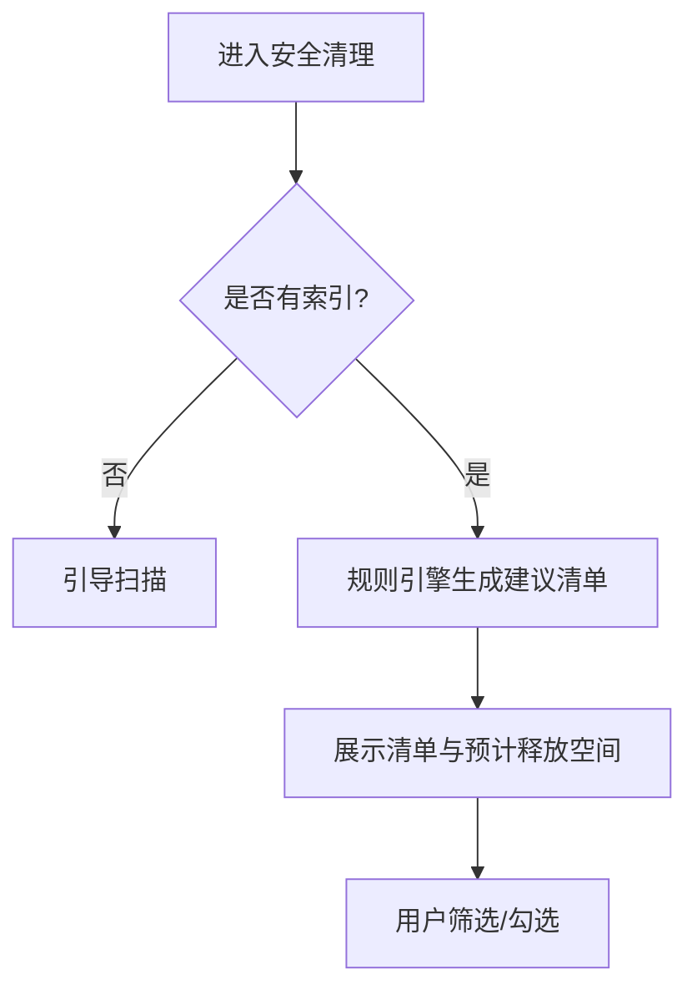
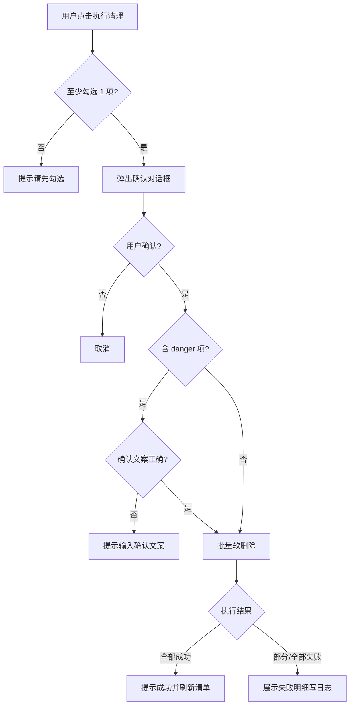

# 安全清理 — 菜单需求文档


| 项目   | 内容                                             |
| ---- | ---------------------------------------------- |
| 文档名称 | 安全清理 — 菜单需求文档                                  |
| 文档版本 | v1.0                                           |
| 状态   | 未确认                                            |
| 确认日期 | —                                              |
| 存放路径 | `docs/current/modules/disk-helper/PRD_安全清理.md` |


---

### 功能概述

本页基于本地索引与**规则引擎**，展示 C 盘**可清理建议清单**及每项的**风险等级**、说明与预计释放空间。用户勾选确认后，将文件**软删除**至隔离区（默认）或系统回收站，并写入操作日志。本页是产品「敢删」能力的核心入口。

与兄弟页分工：「空间浏览」负责定位；本页负责评估与执行清理；隔离文件的管理在「隔离区」子页；AI 解释在「AI 智能分析」，AI 不能绕过本页直接删文件。

### 角色权限


| 维度   | 说明                                                     |
| ---- | ------------------------------------------------------ |
| 数据权限 | 不适用。仅操作本机 C 盘路径。                                       |
| 功能权限 | 个人用户可查看建议、勾选、执行软删除；危险项需二次确认；不可跳过规则引擎直接永久删除（永久删除仅在隔离区）。 |


| 操作            | 个人用户          |
| ------------- | ------------- |
| 查看清理建议清单      | ✓             |
| 勾选并软删除（安全/谨慎） | ✓             |
| 软删除危险项        | 需二次确认且默认取消    |
| 永久删除          | —（在隔离区执行）     |
| 修改规则库         | —（第一版内置，不可编辑） |


### 页面结构

```text
┌────────────────────────────────────────────────────────────────────────┐
│ 主导航：总览 | 浏览 | 清理（当前）| 分析 | 设置                        │
├────────────────────────────────────────────────────────────────────────┤
│ 页标题：安全清理    [预计可释放：XXX]    [跳转：隔离区]                 │
├────────────────────────────────────────────────────────────────────────┤
│ 筛选区：风险等级 [全部|安全|谨慎|危险]  分类 [全部|缓存|临时|下载|…]   │
├────────────────────────────────────────────────────────────────────────┤
│ 工具栏：[全选安全项] [取消全选] [执行清理] [问 AI 解读清单]             │
├────────────────────────────────────────────────────────────────────────┤
│ 建议清单（表格，可勾选）                                                │
│  ☐ | 路径 | 类型 | 大小 | 风险 | 规则说明 | 恢复方式摘要              │
├────────────────────────────────────────────────────────────────────────┤
│ 分页（每页 50 条）                                                      │
└────────────────────────────────────────────────────────────────────────┘
```

- 从「空间浏览」带上下文进入时，清单自动筛选包含该路径的相关建议，并高亮对应行。
- 执行清理前弹出**确认对话框**：展示选中项数量、总大小、默认目标（隔离区）。

### 枚举

#### 枚举：风险等级


| 存储值     | 展示名 | 说明                     |
| ------- | --- | ---------------------- |
| safe    | 安全  | 可清理缓存/临时等；默认勾选策略可全选    |
| caution | 谨慎  | 可能影响应用缓存或体验；默认不勾选      |
| danger  | 危险  | 系统或程序相关；默认不可勾选，需二次确认解锁 |


#### 枚举：清理建议分类


| 存储值            | 展示名   | 说明             |
| -------------- | ----- | -------------- |
| temp           | 临时文件  | 系统/应用 Temp     |
| browser_cache  | 浏览器缓存 | 常见浏览器 Cache 路径 |
| recycle        | 回收站   | 系统回收站内容        |
| download_stale | 陈旧下载  | 下载目录中超期未修改文件   |
| app_cache      | 应用缓存  | 其它已知缓存路径       |
| other          | 其它    | 规则命中但未归类       |


#### 枚举：软删除目标


| 存储值         | 展示名   | 说明        |
| ----------- | ----- | --------- |
| quarantine  | 隔离区   | 默认；可还原    |
| recycle_bin | 系统回收站 | 可在设置中改为默认 |


#### 枚举：清理执行状态


| 存储值     | 展示名  | 说明      |
| ------- | ---- | ------- |
| pending | 待执行  | 勾选未执行   |
| running | 执行中  | 批量移动进行中 |
| success | 成功   | 全部成功    |
| partial | 部分成功 | 部分失败    |
| failed  | 失败   | 全部失败    |


### 目录树

不适用。本页以建议清单表格展示，无目录树。

### 查询功能

本页使用**筛选**而非自由查询表单。


| 字段名    | 类型  | 必填  | 默认值 | 是否唯一值 | 数据来源 | 说明                |
| ------ | --- | --- | --- | ----- | ---- | ----------------- |
| 风险等级筛选 | 枚举  | 否   | 全部  | 否     | 用户选择 | 全部 / 安全 / 谨慎 / 危险 |
| 分类筛选   | 枚举  | 否   | 全部  | 否     | 用户选择 | 对应「清理建议分类」        |
| 路径关键词  | 文本  | 否   | 空   | 否     | 用户输入 | 模糊匹配路径，回车生效       |


- 变更筛选条件后立即刷新清单与「预计可释放」汇总（基于当前筛选下已勾选项或全部安全项，见工具栏说明）。

### 列表展示

#### 清理建议清单


| 字段名    | 类型   | 必填  | 默认值                 | 是否唯一值 | 数据来源  | 说明         |
| ------ | ---- | --- | ------------------- | ----- | ----- | ---------- |
| 勾选     | 布尔   | 否   | 安全项默认 true，其它 false | 否     | 用户/规则 | 危险项默认不可勾选  |
| 路径     | 文本   | 是   | —                   | 是     | 索引+规则 | 完整绝对路径     |
| 条目类型   | 枚举   | 是   | —                   | 否     | 规则    | 文件或文件夹     |
| 大小     | 容量   | 是   | —                   | 否     | 索引    | 预计释放空间     |
| 风险等级   | 枚举   | 是   | —                   | 否     | 规则引擎  | —          |
| 建议分类   | 枚举   | 是   | —                   | 否     | 规则引擎  | —          |
| 规则说明   | 文本   | 是   | —                   | 否     | 规则引擎  | 为何建议清理     |
| 恢复方式摘要 | 文本   | 是   | —                   | 否     | 规则引擎  | 如「可从隔离区还原」 |
| 最后修改时间 | 日期时间 | 否   | —                   | 否     | 索引    | —          |


- 分页：每页 50 条，按大小降序默认排序。
- 清单由扫描索引 + 内置规则引擎生成；无索引时空状态「请先扫描 C 盘」。

### 列表卡片

不适用。

### 工具栏按钮


| 按钮名称      | 主次  | 显隐条件     | 打开方式  | 操作结果                      |
| --------- | --- | -------- | ----- | ------------------------- |
| 全选安全项     | 次按钮 | 有清单      | 本页    | 勾选当前筛选下所有 safe 项          |
| 取消全选      | 次按钮 | 有勾选      | 本页    | 清空所有勾选                    |
| 执行清理      | 主按钮 | 至少勾选 1 项 | 确认对话框 | 见流程图；软删除至默认目标             |
| 问 AI 解读清单 | 次按钮 | 有清单      | 跳转    | 将当前筛选下勾选/全部 safe 项摘要带入 AI |
| 跳转隔离区     | 次按钮 | 始终       | 跳转    | 进入隔离区子页                   |
| 重新生成建议    | 次按钮 | 有索引      | 本页    | 重新运行规则引擎；不改变索引            |


### 表单设计

#### 执行清理确认对话框


| 字段名    | 类型  | 必填  | 默认值 | 是否唯一值 | 数据来源 | 说明                     |
| ------ | --- | --- | --- | ----- | ---- | ---------------------- |
| 选中项数量  | 整数  | 是   | —   | 否     | 计算   | 只读展示                   |
| 预计释放空间 | 容量  | 是   | —   | 否     | 计算   | 只读展示                   |
| 删除目标   | 枚举  | 是   | 隔离区 | 否     | 设置   | 可临时切换为回收站              |
| 确认文案   | 文本  | 是   | —   | 否     | 系统   | 用户须输入「确认清理」方可提交（含危险项时） |


- **入口**：点击「执行清理」。
- **主操作**：确认清理；**取消**：关闭对话框不执行。
- 若含 danger 项：对话框顶部强警告，确认文案必填，默认焦点在取消。

#### 危险项解锁（可选勾选）


| 字段名   | 类型  | 必填  | 默认值   | 是否唯一值 | 数据来源 | 说明               |
| ----- | --- | --- | ----- | ----- | ---- | ---------------- |
| 我了解风险 | 布尔  | 是   | false | 否     | 用户   | 勾选后才可勾选 danger 行 |


### 流程图

#### 生成与展示建议




1. 用户进入页面；无索引则引导至总览扫描。
2. 系统基于索引运行内置规则，生成 C 盘清理建议清单。
3. 展示清单；顶部汇总当前勾选项预计释放空间。

#### 执行软删除




1. 用户勾选条目并点击「执行清理」；未勾选则提示「请先勾选要清理的项」。
2. 弹出确认框，展示数量、大小、删除目标。
3. 若含 danger 项，须输入「确认清理」方可继续。
4. 系统将文件移至隔离区（或回收站）；逐条记录操作日志。
5. 成功：提示释放空间大小，刷新清单；部分失败：列出失败路径与原因，成功项仍生效。

### 导入导出

不适用。

### 数据验证规则

#### 校验范围与场景

执行清理确认对话框；危险项解锁。

#### 正则形态校验（按字段）

##### 确认文案（dangerConfirmText）

1. **适用场景**：执行清理且勾选列表中含 danger 项时。
2. **正则表达式**：

```regex
^确认清理$
```

1. **错误提示**：请输入「确认清理」以继续。

#### 其它验证规则（非正则）

1. **危险项默认不可勾选**：未勾选「我了解风险」时，danger 行勾选框 disabled。
2. **空勾选执行**：不允许；提示「请先勾选要清理的项」。
3. **路径不存在**：执行时若文件已不存在，标记为跳过并计入失败明细，不中断其它项。
4. **文件占用**：无法移动时记录失败原因「文件正在使用或被占用」。
5. **隔离区空间**：移入隔离区前检查目标盘可用空间；不足时提示「磁盘空间不足，无法移入隔离区」并中止。

#### 跨字段与业务规则

1. **规则引擎优先**：无论 AI 如何建议，执行清理必须以本页勾选 + 规则等级为准。
2. **预计释放空间**：为勾选项大小之和；文件夹按索引聚合大小估算，执行后以实际为准。
3. **第一版规则库内置不可编辑**；规则版本随应用发布更新。

#### 规则汇总（验收清单）

1. 有索引时可生成建议清单，风险等级与规则说明正确。
2. 安全项可批量勾选并软删除至隔离区。
3. 危险项默认不可勾选；解锁 + 确认文案后可执行。
4. 执行后操作日志有记录，清单刷新，总览空间更新。
5. 部分失败时展示失败明细，不误报全部成功。
6. 本页无永久删除入口。

### 注意事项

1. 第一版仅针对 **C 盘**路径生成建议。
2. 内置规则覆盖 Temp、浏览器缓存、回收站、下载目录陈旧文件等；未命中规则的路径不会出现在建议清单（仍可在空间浏览中手动关注）。
3. AI 解读仅为辅助入口，不在本页展示 AI 的自动勾选。
4. 软删除默认目标为隔离区，与「设置」中默认值一致。

