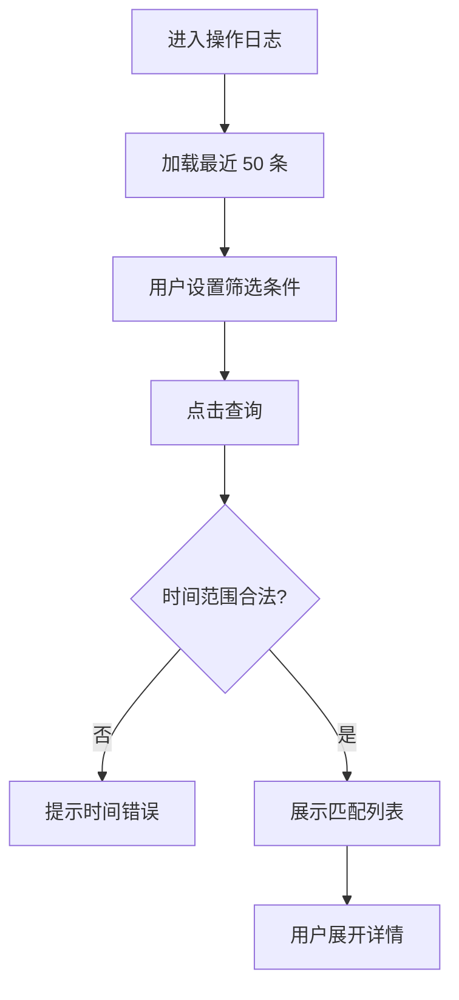

# 操作日志 — 菜单需求文档

| 项目 | 内容 |
|------|------|
| 文档名称 | 操作日志 — 菜单需求文档 |
| 文档版本 | v1.0 |
| 状态 | 未确认 |
| 确认日期 | — |
| 存放路径 | `docs/current/modules/disk-helper/PRD_操作日志.md` |

---

### 功能概述

本页展示应用在本地产生的**操作审计记录**，包括扫描、软删除、还原、永久删除、AI 咨询等事件，便于用户追溯「何时做了什么、结果如何」。支持按类型与时间筛选，并导出诊断摘要（不含 API Key）。

与兄弟页分工：各业务页执行操作时写入日志；本页只读展示与管理导出。

### 角色权限

| 维度 | 说明 |
|------|------|
| 数据权限 | 不适用。仅本机日志文件。 |
| 功能权限 | 个人用户可查看、筛选、导出摘要、清空日志。 |

| 操作 | 个人用户 |
|------|----------|
| 查看日志 | ✓ |
| 筛选 / 搜索 | ✓ |
| 导出诊断摘要 | ✓ |
| 清空全部日志 | ✓（二次确认） |
| 修改历史日志 | — |

### 页面结构

```text
┌────────────────────────────────────────────────────────────────────────┐
│ 主导航：… | 设置（当前）> 操作日志（子页 Tab 或侧栏）                  │
├────────────────────────────────────────────────────────────────────────┤
│ 页标题：操作日志                                                        │
├────────────────────────────────────────────────────────────────────────┤
│ 筛选区：事件类型 [全部|…]  时间范围 [开始] [结束]  关键词 [路径/摘要]   │
│         [查询] [重置]                                                   │
├────────────────────────────────────────────────────────────────────────┤
│ 工具栏：[导出诊断摘要] [清空日志]                                       │
├────────────────────────────────────────────────────────────────────────┤
│ 日志列表（表格）                                                        │
│  时间 | 事件类型 | 摘要 | 结果 | 详情                                   │
├────────────────────────────────────────────────────────────────────────┤
│ 分页（每页 50 条）                                                      │
└────────────────────────────────────────────────────────────────────────┘
```

- 点击「详情」展开行或侧滑展示完整字段（如失败原因列表）。

### 枚举

#### 枚举：日志事件类型

| 存储值 | 展示名 | 说明 |
|--------|--------|------|
| scan_start | 扫描开始 | 全量/增量 |
| scan_complete | 扫描完成 | 含耗时、文件数 |
| scan_fail | 扫描失败 | — |
| soft_delete | 软删除 | 移入隔离区或回收站 |
| restore | 还原 | 从隔离区 |
| purge | 永久删除 | 从隔离区 |
| ai_query | AI 咨询 | 仅记录成功与否，默认不含对话正文 |
| settings_change | 设置变更 | 不含 Key 明文 |

#### 枚举：日志结果

| 存储值 | 展示名 | 说明 |
|--------|--------|------|
| success | 成功 | — |
| partial | 部分成功 | 批量操作 |
| failed | 失败 | — |
| info | 信息 | 仅记录性事件 |

### 目录树

不适用。

### 查询功能

| 字段名 | 类型 | 必填 | 默认值 | 是否唯一值 | 数据来源 | 说明 |
|--------|------|------|--------|------------|----------|------|
| 事件类型 | 枚举 | 否 | 全部 | 否 | 用户选择 | 对应「日志事件类型」 |
| 开始时间 | 日期时间 | 否 | 空 | 否 | 用户 | 含该时刻起 |
| 结束时间 | 日期时间 | 否 | 空 | 否 | 用户 | 含该时刻止 |
| 关键词 | 文本 | 否 | 空 | 否 | 用户 | 匹配摘要或路径字段 |

**交互行为**：

- 点击「查询」刷新列表；「重置」清空条件并加载默认列表。
- 关键词输入后回车等同查询。
- 若开始时间晚于结束时间，提示「开始时间不能晚于结束时间」。

### 列表展示

#### 操作日志列表

| 字段名 | 类型 | 必填 | 默认值 | 是否唯一值 | 数据来源 | 说明 |
|--------|------|------|--------|------------|----------|------|
| 日志标识 | 文本 | 是 | — | 是 | 系统 | 对应数据键：logId |
| 发生时间 | 日期时间 | 是 | — | 否 | 系统 | — |
| 事件类型 | 枚举 | 是 | — | 否 | 系统 | — |
| 摘要 | 文本 | 是 | — | 否 | 系统 | 一行可读描述 |
| 结果 | 枚举 | 是 | — | 否 | 系统 | success/partial/failed/info |
| 关联路径 | 文本 | 否 | — | 否 | 系统 | 主路径或计数 |
| 释放空间 | 容量 | 否 | — | 否 | 系统 | 清理类事件 |
| 失败原因 | 长文本 | 否 | — | 否 | 系统 | 详情展开 |

- 默认按发生时间降序；分页每页 50 条。
- 本地最多保留 5000 条；超出时 FIFO 删除最旧记录（写入时触发）。

### 列表卡片

不适用。

### 工具栏按钮

| 按钮名称 | 主次 | 显隐条件 | 打开方式 | 操作结果 |
|----------|------|----------|----------|----------|
| 导出诊断摘要 | 次按钮 | 有日志 | 保存对话框 | 导出 JSON 或 TXT，脱敏，不含 API Key |
| 清空日志 | 次按钮 | 有日志 | 二次确认 | 删除全部本地日志 |
| 查询 | 次按钮 | 始终 | 本页 | 按条件刷新 |
| 重置 | 次按钮 | 始终 | 本页 | 清空筛选 |

### 表单设计

#### 清空日志确认

| 字段名 | 类型 | 必填 | 默认值 | 是否唯一值 | 数据来源 | 说明 |
|--------|------|------|--------|------------|----------|------|
| 确认 | 布尔 | 是 | false | 否 | 用户 | 勾选「我确认清空全部日志」后可提交 |

### 流程图

#### 查询与查看



1. 用户进入页面，默认展示最近日志。
2. 用户设置筛选并查询；时间非法则拦截。
3. 用户点击详情查看完整字段。

#### 导出诊断摘要

1. 用户点击「导出诊断摘要」。
2. 系统生成含应用版本、最近 100 条日志、扫描统计的脱敏文件。
3. 校验导出内容不含 API Key 明文；保存至用户选择路径。

### 导入导出

#### 导出说明

- 支持导出**诊断摘要**为 `.json` 或 `.txt`（用户选择）。
- 导出范围为当前筛选结果或最近 100 条（取较少者，上限 100）。
- 不含 API Key、不含完整 AI 对话正文。

#### 导出字段表

| 名称 | key | 类型 | 必填（导出） | 默认值 | 是否唯一值 | 数据来源 | 脱敏 |
|------|-----|------|--------------|--------|------------|----------|------|
| 发生时间 | occurredAt | 日期时间 | 是 | — | 否 | 日志 | 否 |
| 事件类型 | eventType | 文本 | 是 | — | 否 | 日志 | 否 |
| 摘要 | summary | 文本 | 是 | — | 否 | 日志 | 路径脱敏 |
| 结果 | result | 文本 | 是 | — | 否 | 日志 | 否 |
| 应用版本 | appVersion | 文本 | 是 | — | 否 | 系统 | 否 |

#### 导入

不适用。本页不支持导入。

### 数据验证规则

#### 校验范围与场景

查询时间范围；清空日志确认。

#### 正则形态校验（按字段）

本页无正则校验字段。

#### 其它验证规则（非正则）

1. **时间范围**：若同时填写开始与结束，开始 ≤ 结束；否则提示「开始时间不能晚于结束时间」。
2. **清空日志**：须勾选确认复选框；否则按钮 disabled。
3. **导出脱敏**：导出前扫描内容，若含 Key 模式则阻断并提示「导出内容异常，请联系支持」（内部错误态）。
4. **日志保留上限**：超过 5000 条自动淘汰最旧记录，无需用户操作。

#### 跨字段与业务规则

1. `ai_query` 类型默认 summary 为「AI 咨询成功/失败」，不含用户问题正文（可在设置中关闭 AI 日志，第一版默认开启仅元数据）。
2. `settings_change` 不记录 API Key 变更前后值，仅记录「API Key 已更新」。

#### 规则汇总（验收清单）

1. 扫描、清理、还原、永久删除、AI 咨询事件均能在列表中找到。
2. 筛选与关键词搜索正确。
3. 导出文件不含 API Key，路径已脱敏。
4. 清空日志后列表为空。
5. 详情可展开查看失败原因。

### 注意事项

1. 日志仅存本地，不上传云端。
2. 第一版不提供日志自动上传或远程诊断服务。
3. 时间显示使用用户系统时区。
