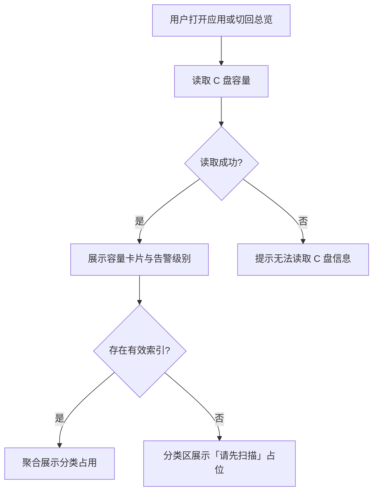
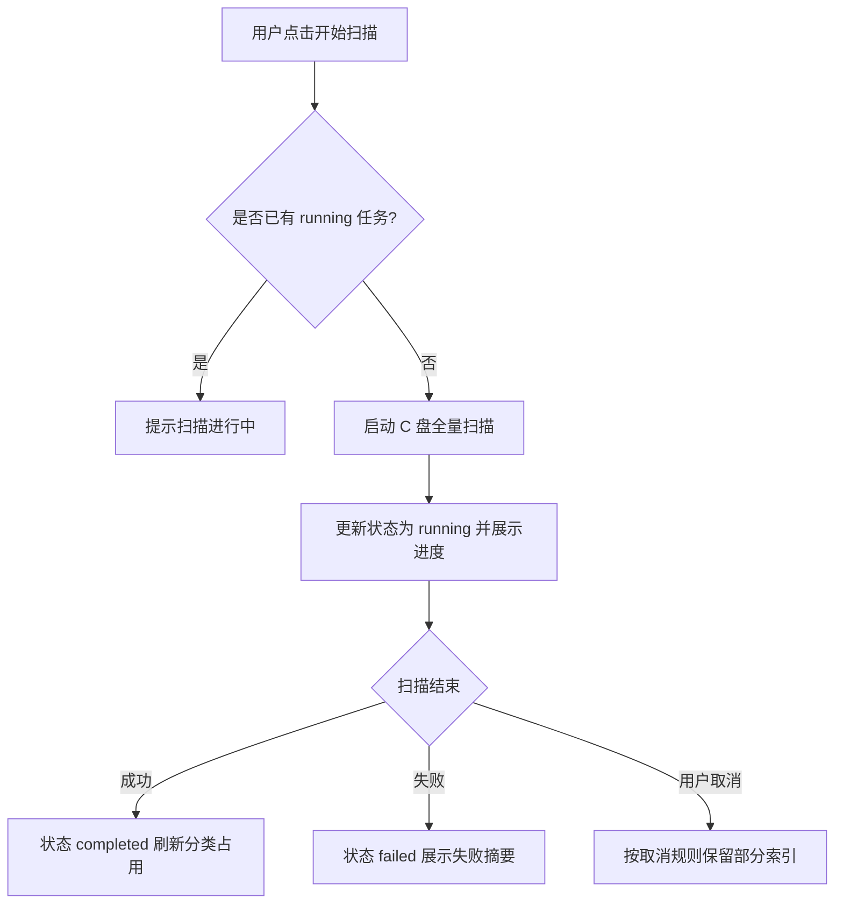

# 磁盘总览 — 菜单需求文档

| 项目 | 内容 |
|------|------|
| 文档名称 | 磁盘总览 — 菜单需求文档 |
| 文档版本 | v1.0 |
| 状态 | 未确认 |
| 确认日期 | — |
| 存放路径 | `docs/current/modules/disk-helper/PRD_磁盘总览.md` |

---

### 功能概述

本页为应用**首页**，用于展示 **C 盘**空间总体状况、按类别的占用分布、最近一次扫描状态，并提供进入「空间浏览」「安全清理」「AI 智能分析」的快捷入口。用户打开应用后应在此页快速判断「C 盘是否紧张、大头在哪一类、是否需要重新扫描」。

与兄弟页分工：本页不做目录级浏览与清理执行；详细目录与 Treemap 在「空间浏览」，清理建议在「安全清理」。

### 角色权限

第一版为单用户本地应用，无数据权限分级。

| 维度 | 说明 |
|------|------|
| 数据权限 | 不适用。仅展示本机 C 盘及本地索引数据。 |
| 功能权限 | 个人用户可查看总览、发起/查看扫描状态、通过快捷入口跳转其他菜单。 |

| 操作 | 个人用户 |
|------|----------|
| 查看 C 盘容量与分类占用 | ✓ |
| 发起扫描 / 查看扫描进度 | ✓ |
| 跳转空间浏览 / 安全清理 / AI 分析 | ✓ |

### 页面结构

```text
┌──────────────────────────────────────────────────────────────┐
│ 主导航：总览（当前）| 浏览 | 清理 | 分析 | 设置              │
├──────────────────────────────────────────────────────────────┤
│ 页标题：磁盘总览                                              │
├──────────────────────────────────────────────────────────────┤
│ 【C 盘容量卡片】                                              │
│   总容量 / 已用 / 可用 / 使用率进度条                         │
├──────────────────────────────────────────────────────────────┤
│ 【扫描状态条】 上次扫描时间 | 状态 | [开始扫描] [增量扫描]      │
├──────────────────────────────────────────────────────────────┤
│ 【分类占用】 横向或网格：系统|程序|用户文档|缓存临时|下载|其他  │
├──────────────────────────────────────────────────────────────┤
│ 【快捷入口】 [查看空间浏览] [查看清理建议] [问 AI]            │
├──────────────────────────────────────────────────────────────┤
│ 【可选】可用空间不足提示条（低于阈值时显示）                    │
└──────────────────────────────────────────────────────────────┘
```

- 扫描进行中时，扫描状态条展示进度百分比与已扫描文件数；主内容区其余部分仍可读，不因扫描完全不可用。
- 「开始扫描」触发全量扫描；「增量扫描」在已有索引时可用，无索引时置灰并提示需先全量扫描。

### 枚举

#### 枚举：扫描任务状态

| 存储值 | 展示名 | 说明 |
|--------|--------|------|
| idle | 未扫描 | 从未完成过全量扫描，或索引已被用户清除 |
| running | 扫描中 | 全量或增量扫描进行中 |
| paused | 已暂停 | 用户暂停，可继续或取消 |
| completed | 已完成 | 最近一次扫描成功结束 |
| failed | 失败 | 扫描异常终止，展示失败摘要 |

#### 枚举：空间分类

| 存储值 | 展示名 | 说明 |
|--------|--------|------|
| system | 系统 | Windows 及系统相关目录聚合 |
| program | 程序 | 已安装应用程序占用 |
| user_doc | 用户文档 | 文档、图片、视频等用户文件 |
| cache_temp | 缓存/临时 | 临时文件、应用缓存 |
| download | 下载 | 下载目录及同类路径 |
| other | 其他 | 未归入以上类别的占用 |

#### 枚举：空间告警级别

| 存储值 | 展示名 | 说明 |
|--------|--------|------|
| normal | 正常 | 可用空间高于警告阈值 |
| warning | 空间偏紧 | 可用空间低于警告阈值（默认 10GB，可在设置中调整） |
| critical | 空间严重不足 | 可用空间低于严重阈值（默认 2GB） |

### 目录树

不适用。本页无目录树；目录级结构在「空间浏览」展示。

### 查询功能

不适用。本页为仪表盘，无查询区。

### 列表展示

不适用。本页以统计卡片与分类区块展示，无数据表格列表。

#### 统计展示字段（C 盘容量卡片）

| 字段名 | 类型 | 必填 | 默认值 | 是否唯一值 | 数据来源 | 说明 |
|--------|------|------|--------|------------|----------|------|
| 盘符 | 文本 | 是 | C: | 是 | 系统 | 第一版固定 C 盘 |
| 总容量 | 容量 | 是 | — | 否 | 系统 | 字节数，界面友好格式化 |
| 已用空间 | 容量 | 是 | — | 否 | 系统 | 与总容量同期读取 |
| 可用空间 | 容量 | 是 | — | 否 | 系统 | 与总容量同期读取 |
| 使用率 | 百分比 | 是 | — | 否 | 计算 | 已用/总容量，保留一位小数 |

#### 统计展示字段（分类占用）

| 字段名 | 类型 | 必填 | 默认值 | 是否唯一值 | 数据来源 | 说明 |
|--------|------|------|--------|------------|----------|------|
| 分类 | 枚举 | 是 | — | 否 | 索引+规则 | 对应「空间分类」枚举 |
| 占用大小 | 容量 | 是 | — | 否 | 索引聚合 | 该分类下文件大小之和 |
| 占比 | 百分比 | 是 | — | 否 | 计算 | 相对 C 盘已用空间 |

#### 扫描状态字段

| 字段名 | 类型 | 必填 | 默认值 | 是否唯一值 | 数据来源 | 说明 |
|--------|------|------|--------|------------|----------|------|
| 扫描状态 | 枚举 | 是 | idle | 否 | 扫描服务 | 对应「扫描任务状态」 |
| 上次扫描完成时间 | 日期时间 | 否 | — | 否 | 本地索引 | 未完成时为「—」 |
| 扫描进度 | 百分比 | 否 | — | 否 | 扫描服务 | 仅 running/paused 时展示 |
| 已扫描文件数 | 整数 | 否 | — | 否 | 扫描服务 | 仅 running/paused 时展示 |
| 跳过文件数 | 整数 | 否 | 0 | 否 | 扫描服务 | 权限不足或占用导致 |

### 列表卡片

不适用。分类占用以统计卡片/区块展示，无列表与卡片视图切换。

### 工具栏按钮

| 按钮名称 | 主次 | 显隐条件 | 打开方式 | 操作结果 |
|----------|------|----------|----------|----------|
| 开始扫描 | 主按钮 | 扫描状态非 running | 本页点击 | 发起 C 盘全量扫描；状态变为 running；若已有 running 任务则提示「扫描进行中」 |
| 增量扫描 | 次按钮 | 存在有效索引且非 running | 本页点击 | 发起增量扫描；无索引时置灰，悬停提示「请先完成全量扫描」 |
| 暂停扫描 | 次按钮 | 扫描状态为 running | 本页点击 | 暂停扫描，状态变为 paused |
| 继续扫描 | 次按钮 | 扫描状态为 paused | 本页点击 | 从暂停处继续，状态变为 running |
| 取消扫描 | 次按钮 | 扫描状态为 running 或 paused | 确认对话框 | 终止本次扫描；保留已完成部分的索引（若有）；状态变为 idle 或 completed（视已扫描比例提示） |
| 查看空间浏览 | 次按钮 | 始终显示 | 跳转 | 进入「空间浏览」菜单 |
| 查看清理建议 | 次按钮 | 索引状态为 completed | 跳转 | 进入「安全清理」；无索引时置灰并提示先扫描 |
| 问 AI | 次按钮 | 始终显示 | 跳转 | 进入「AI 智能分析」 |
| 刷新 | 次按钮 | 始终显示 | 本页点击 | 重新读取 C 盘容量（不触发全量扫描）；更新分类占用（基于现有索引） |

### 表单设计

不适用。本页无表单录入；扫描确认使用轻量确认对话框，不构成独立表单页。

### 流程图

#### 进入总览与展示容量



1. 用户打开应用或从其他菜单返回「磁盘总览」。
2. 系统读取 C 盘总容量、已用、可用；失败则提示「无法读取 C 盘信息，请检查磁盘是否可用」。
3. 根据可用空间与阈值计算告警级别，必要时展示提示条。
4. 若存在有效索引，聚合展示六类占用；否则分类区显示引导文案「完成扫描后可查看分类占用」。
5. 同步展示最近一次扫描状态与时间。

#### 发起扫描



1. 用户点击「开始扫描」；若已在扫描中，提示「扫描进行中，请稍候」。
2. 系统启动 C 盘全量扫描，状态变为 running，展示进度与已扫描文件数。
3. 扫描成功：状态 completed，刷新分类占用与上次扫描时间。
4. 扫描失败：状态 failed，展示失败原因摘要（如权限、磁盘不可访问），建议用户重试或启用管理员扫描（见设置）。
5. 用户取消：弹出确认「确定取消本次扫描？」；确认后终止任务。

### 导入导出

不适用。本页无导入导出能力。

### 数据验证规则

#### 校验范围与场景

本页无用户输入表单；仅「取消扫描」涉及确认操作。

#### 正则形态校验（按字段）

本页无正则校验字段。取消扫描为布尔确认，不适用正则。

#### 其它验证规则（非正则）

1. **扫描互斥**：同一时刻仅允许一个 C 盘扫描任务；重复点击开始扫描不创建新任务，提示「扫描进行中」。
2. **增量扫描前置**：无有效索引时，增量扫描不可点击；提示「请先完成全量扫描」。
3. **容量读取失败**：C 盘不可访问时，容量卡片显示错误态，扫描按钮置灰，提示检查磁盘。

#### 跨字段与业务规则

1. **分类占用依赖索引**：分类占用数据来自本地索引聚合；无索引时不展示具体数值，避免与系统 API 分类口径不一致。
2. **告警阈值**：警告与严重阈值读取「设置」中的配置；设置变更后返回总览时重新计算。

#### 规则汇总（验收清单）

1. 打开应用默认进入本页，正确展示 C 盘容量。
2. 无索引时分类区显示引导，不展示虚假分类数据。
3. 全量扫描可完成并更新分类占用与扫描时间。
4. 扫描进行中可暂停、继续、取消。
5. 可用空间低于阈值时展示对应告警提示条。
6. 快捷入口可正确跳转至浏览、清理、分析菜单。

### 注意事项

1. 第一版**仅 C 盘**；盘符固定展示，不提供盘符切换。
2. 总览上的「已用/可用」来自系统实时读取；「分类占用」来自扫描索引，二者刷新时机不同，需在 UI 上区分（如分类区标注「基于上次扫描」）。
3. 扫描任务后台进行时，用户切换至其他菜单不应中断扫描。
4. 本页不执行任何删除或移动文件操作。
