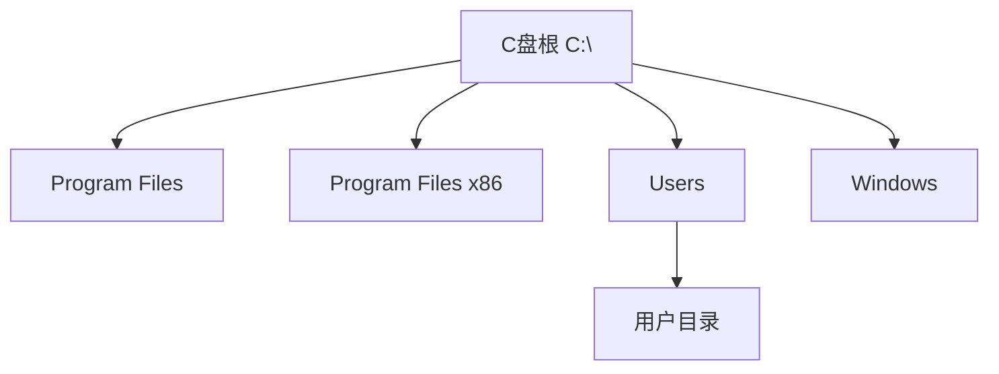
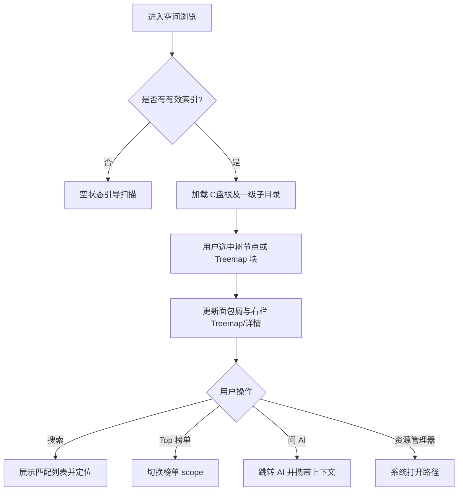

# 空间浏览 — 菜单需求文档

| 项目 | 内容 |
|------|------|
| 文档名称 | 空间浏览 — 菜单需求文档 |
| 文档版本 | v1.0 |
| 状态 | 未确认 |
| 确认日期 | — |
| 存放路径 | `docs/current/modules/disk-helper/PRD_空间浏览.md` |

---

### 功能概述

本页用于**细读 C 盘空间占用**：通过目录树、Treemap 方块图、大文件/大文件夹榜单，帮助用户从「盘符 → 目录 → 文件」逐级定位空间大户。用户可选中节点查看详情，并可将选中项作为上下文跳转至「AI 智能分析」或「安全清理」。

与兄弟页分工：「磁盘总览」提供宏观容量；本页负责目录级阅读；实际清理在「安全清理」，AI 解释在「AI 智能分析」。

### 角色权限

| 维度 | 说明 |
|------|------|
| 数据权限 | 不适用。展示本机 C 盘索引数据；无管理员权限时部分系统目录可能标记为「未完整扫描」。 |
| 功能权限 | 个人用户可浏览、搜索、排序、跳转 AI/清理；不可在本页直接删除文件。 |

| 操作 | 个人用户 |
|------|----------|
| 浏览目录树 / Treemap / 榜单 | ✓ |
| 搜索与路径定位 | ✓ |
| 查看文件/文件夹详情 | ✓ |
| 跳转 AI 分析（带选中上下文） | ✓ |
| 跳转安全清理（带选中上下文） | ✓ |
| 在本页删除文件 | — |

### 页面结构

```text
┌────────────────────────────────────────────────────────────────────────┐
│ 主导航：总览 | 浏览（当前）| 清理 | 分析 | 设置                        │
├────────────────────────────────────────────────────────────────────────┤
│ 页标题：空间浏览          [视图：树+图 | 仅树 | 仅图]  [刷新索引]       │
├──────────────────┬─────────────────────────────────────────────────────┤
│ 目录树（左栏）    │ 主内容区（右栏）                                     │
│                  │ ┌─ 面包屑：C:\...\当前路径 ─────────────────────┐  │
│  C:\             │ │ 工具栏：[搜索] [大文件Top] [大文件夹Top]        │  │
│  ├─ Program Files│ ├─ Treemap 方块图（当前目录子项）               │  │
│  ├─ Users        │ └─ 或：榜单列表 / 详情面板                       │  │
│  └─ ...          │                                                     │
├──────────────────┴─────────────────────────────────────────────────────┤
│ 底部详情条（可选）：选中项 名称|路径|大小|修改时间|类型|风险等级(若有)  │
└────────────────────────────────────────────────────────────────────────┘
```

- 左栏目录树与右栏 Treemap/榜单**联动**：选中树节点，右栏展示该目录下子项占用。
- 点击 Treemap 方块等价于选中对应目录/文件节点。
- 无索引时，主内容区展示空状态：「请先完成 C 盘扫描」，并提供跳转总览扫描的链接。

### 枚举

#### 枚举：浏览视图模式

| 存储值 | 展示名 | 说明 |
|--------|--------|------|
| tree_and_map | 树+图 | 默认；左树右 Treemap |
| tree_only | 仅树 | 隐藏 Treemap，榜单/详情占满右栏 |
| map_only | 仅图 | 隐藏左树，Treemap 全宽（根为 C:\） |

#### 枚举：右栏内容模式

| 存储值 | 展示名 | 说明 |
|--------|--------|------|
| treemap | Treemap | 当前目录下一级子项方块图 |
| top_files | 大文件 Top | C 盘或当前目录下大文件榜单 |
| top_folders | 大文件夹 Top | C 盘或当前目录下大文件夹榜单 |
| detail | 详情 | 单选中项详情面板 |

#### 枚举：节点类型

| 存储值 | 展示名 | 说明 |
|--------|--------|------|
| drive | 盘符 | 第一版仅 C:\ |
| folder | 文件夹 | 可展开 |
| file | 文件 | 叶子节点 |

#### 枚举：索引覆盖状态

| 存储值 | 展示名 | 说明 |
|--------|--------|------|
| full | 已扫描 | 该路径在本次索引中完整统计 |
| partial | 部分扫描 | 子项存在跳过（权限/占用） |
| skipped | 未扫描 | 无权限或未纳入扫描 |

### 目录树

#### 树形层级结构

```text
C:\                          [drive, 根]
├── Program Files\           [folder]
├── Program Files (x86)\     [folder]
├── Users\                   [folder]
│   └── {用户名}\            [folder]
├── Windows\                 [folder]
└── …                        [folder / file]
```



#### 树节点字段表

| 字段名 | 类型 | 必填 | 默认值 | 是否唯一值 | 数据来源 | 说明 |
|--------|------|------|--------|------------|----------|------|
| 节点标识 | 文本 | 是 | — | 是 | 索引 | 对应数据键：nodeId；规范化绝对路径 |
| 父节点标识 | 文本 | 否 | — | 否 | 索引 | 根节点为空；对应数据键：parentId |
| 显示名 | 文本 | 是 | — | 否 | 路径 | 最后一级目录或文件名 |
| 完整路径 | 文本 | 是 | — | 是 | 索引 | C 盘绝对路径 |
| 节点类型 | 枚举 | 是 | folder | 否 | 索引 | 对应「节点类型」 |
| 占用大小 | 容量 | 是 | 0 | 否 | 索引 | 文件夹含子项聚合大小 |
| 排序权重 | 整数 | 是 | 按大小降序 | 否 | 索引 | 同级默认按占用大小降序 |
| 是否叶子 | 布尔 | 是 | — | 否 | 索引 | 文件为 true；空文件夹为 true |
| 覆盖状态 | 枚举 | 是 | full | 否 | 扫描结果 | 对应「索引覆盖状态」 |

#### 层级与根

| 维度 | 规则 |
|------|------|
| 最大深度 | 不人为限制；懒加载按层展开 |
| 根节点 | 单根 `C:\` |
| 虚拟根 | 无 |
| 同级排序 | 默认按占用大小降序；用户可切换为名称升序 |
| 父子表达 | parentId 指向父路径 nodeId |

#### 与主区联动

| 行为 | 规则 |
|------|------|
| 选中节点 | 右栏 Treemap/面包屑/详情同步至该目录；大文件/大文件夹榜单默认 scope 为「当前选中目录」 |
| 展开节点 | 懒加载加载直接子节点；未展开不加载子级 |
| 未选中 | 默认选中 C:\ 根节点 |
| 选中态持久 | 切换右栏内容模式时保持选中节点；切换至其他菜单再返回时恢复上次选中路径 |

#### 加载策略

| 类型 | 规则 |
|------|------|
| 首屏 | 加载 C:\ 根及第一层子目录列表（来自索引） |
| 懒加载 | 用户展开某文件夹时，加载其直接子节点 |
| 数据来源 | 本地扫描索引；非实时文件系统 walk |

#### 树上操作

| 操作 | 是否支持 | 说明 |
|------|----------|------|
| 展开/折叠 | ✓ | — |
| 选中 | ✓ | — |
| 新增/删除/拖拽 | — | 本页只读浏览 |

#### 初态

- 默认展开 C:\ 根下一级。
- 默认选中 C:\ 根节点。
- 无索引时空树占位：「暂无索引数据，请先扫描 C 盘」。

### 查询功能

本页提供**路径/名称搜索**，非传统多条件查询表单。

| 字段名 | 类型 | 必填 | 默认值 | 是否唯一值 | 数据来源 | 说明 |
|--------|------|------|--------|------------|----------|------|
| 搜索关键词 | 文本 | 否 | 空 | 否 | 用户输入 | 匹配路径或文件名，不区分大小写 |

**交互行为**：

- 用户输入关键词后按回车或点击搜索，系统在索引中检索，结果以列表展示（最多 200 条，超出提示缩小关键词）。
- 点击结果项：目录树定位并选中对应节点，右栏同步。
- 清空搜索框并回车：退出搜索结果，恢复树+图视图。

### 列表展示

#### 大文件 Top 榜单

| 字段名 | 类型 | 必填 | 默认值 | 是否唯一值 | 数据来源 | 说明 |
|--------|------|------|--------|------------|----------|------|
| 排名 | 整数 | 是 | — | 否 | 计算 | 1 起 |
| 文件名 | 文本 | 是 | — | 否 | 索引 | — |
| 完整路径 | 文本 | 是 | — | 是 | 索引 | 可点击定位 |
| 大小 | 容量 | 是 | — | 否 | 索引 | — |
| 修改时间 | 日期时间 | 否 | — | 否 | 索引 | — |
| 风险等级 | 枚举 | 否 | — | 否 | 规则引擎 | 引用安全清理枚举；无规则时为「—」 |

- 默认 Top 100；scope 为当前选中目录，根节点时为全 C 盘。
- 支持按大小降序（默认）、修改时间降序切换。

#### 大文件夹 Top 榜单

| 字段名 | 类型 | 必填 | 默认值 | 是否唯一值 | 数据来源 | 说明 |
|--------|------|------|--------|------------|----------|------|
| 排名 | 整数 | 是 | — | 否 | 计算 | — |
| 文件夹名 | 文本 | 是 | — | 否 | 索引 | — |
| 完整路径 | 文本 | 是 | — | 是 | 索引 | — |
| 占用大小 | 容量 | 是 | — | 否 | 索引 | 含子项聚合 |
| 风险等级 | 枚举 | 否 | — | 否 | 规则引擎 | — |

- 默认 Top 50；排序与 scope 规则同大文件榜单。

#### Treemap 方块数据项

| 字段名 | 类型 | 必填 | 默认值 | 是否唯一值 | 数据来源 | 说明 |
|--------|------|------|--------|------------|----------|------|
| 名称 | 文本 | 是 | — | 否 | 索引 | 子项名 |
| 路径 | 文本 | 是 | — | 否 | 索引 | — |
| 大小 | 容量 | 是 | — | 否 | 索引 | 决定方块面积 |
| 节点类型 | 枚举 | 是 | — | 否 | 索引 | 文件/文件夹着色区分 |

- 单屏展示当前目录下最多 500 个子项；超出时合并为「其他」方块。

### 列表卡片

不适用。榜单为表格列表，Treemap 为图形视图，无卡片切换。

### 工具栏按钮

| 按钮名称 | 主次 | 显隐条件 | 打开方式 | 操作结果 |
|----------|------|----------|----------|----------|
| 搜索 | 次按钮 | 始终 | 聚焦搜索框 | 见「查询功能」 |
| 大文件 Top | 次按钮 | 有索引 | 切换右栏 | 右栏切至大文件榜单 |
| 大文件夹 Top | 次按钮 | 有索引 | 切换右栏 | 右栏切至大文件夹榜单 |
| 返回 Treemap | 次按钮 | 右栏非 treemap | 切换右栏 | 回到 Treemap 视图 |
| 刷新索引 | 次按钮 | 始终 | 本页点击 | 从本地重新加载索引快照，不触发磁盘 re-scan |
| 问 AI（选中项） | 主按钮 | 已选中文件或文件夹 | 跳转 | 带选中路径与摘要进入 AI 分析 |
| 查看清理建议（选中项） | 次按钮 | 已选中且存在规则评估 | 跳转 | 进入安全清理并定位相关建议 |
| 在资源管理器中打开 | 次按钮 | 已选中 | 系统调用 | 打开 Windows 资源管理器并选中该路径 |
| 复制路径 | 次按钮 | 已选中 | 本页 | 完整路径写入剪贴板，提示「已复制」 |

### 表单设计

不适用。本页无录入表单。

### 流程图

#### 浏览与联动



1. 用户进入「空间浏览」；无索引则展示空状态与扫描引导。
2. 系统加载 C:\ 根节点及一级子目录，默认选中根，右栏展示 Treemap。
3. 用户选中树节点或点击 Treemap 方块，面包屑与右栏同步。
4. 用户切换「大文件 Top / 大文件夹 Top」，榜单 scope 默认为当前选中目录。
5. 用户点击「问 AI」，携带选中路径、大小、类型、风险等级（若有）跳转至 AI 分析。

#### 搜索定位

1. 用户输入关键词并搜索。
2. 系统在索引中匹配路径/文件名；无结果提示「未找到匹配项」。
3. 用户点击某结果，树展开并选中，右栏更新。

### 导入导出

不适用。本页无导入导出。

### 数据验证规则

#### 校验范围与场景

搜索关键词输入。

#### 正则形态校验（按字段）

本页无正则校验字段。搜索关键词允许任意文本，空关键词不触发检索。

#### 其它验证规则（非正则）

1. **搜索关键词长度**：1～200 字符；超长提示「关键词过长，请缩短后重试」。
2. **索引前置**：无索引时，除空状态引导外，搜索与榜单不可用。
3. **路径有效性**：若索引中路径在磁盘上已不存在，详情条目标注「路径可能已变更」，刷新索引后更新。

#### 跨字段与业务规则

1. Treemap 仅展示**当前选中目录的直接子项**；不递归展开全部子孙到单层。
2. 风险等级来自规则引擎，本页只展示不裁决；与「安全清理」口径一致。

#### 规则汇总（验收清单）

1. 有索引时可浏览目录树并懒加载子节点。
2. 树选中与 Treemap 双向联动正确。
3. 大文件/大文件夹 Top 榜单数据与索引一致，scope 切换正确。
4. 搜索可定位到目录树节点。
5. 「问 AI」正确携带选中项上下文。
6. 本页无任何删除/移动文件入口。

### 注意事项

1. 第一版 scope 固定 **C 盘**；树根固定 `C:\`。
2. 浏览数据来自索引，与磁盘实时状态可能存在延迟；提供「刷新索引」与总览「增量扫描」引导。
3. 无管理员权限时，部分系统目录显示 partial/skipped 状态，不应展示为 0 字节误导用户。
4. Treemap 颜色区分文件/文件夹/风险等级时，图例需可见。
