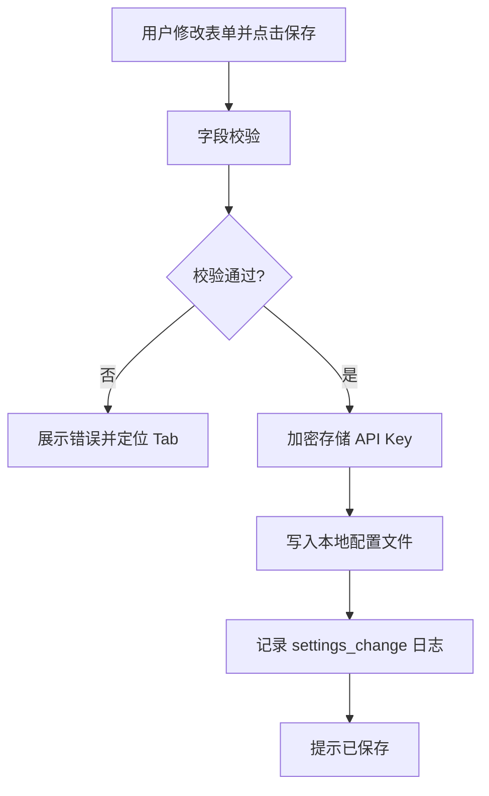

# 设置 — 菜单需求文档

| 项目 | 内容 |
|------|------|
| 文档名称 | 设置 — 菜单需求文档 |
| 文档版本 | v1.0 |
| 状态 | 未确认 |
| 确认日期 | — |
| 存放路径 | `docs/current/modules/disk-helper/PRD_设置.md` |

---

### 功能概述

本页集中管理应用配置：**云端 AI API Key**（第一版仅一家 Provider）、**界面主题**、**隔离区策略**、**扫描与空间告警**、**软删除默认目标**等。并提供进入「操作日志」子页的入口。

与兄弟页分工：各业务页读取此处配置；修改后立即生效或提示需重启扫描（见各字段说明）。

### 角色权限

| 维度 | 说明 |
|------|------|
| 数据权限 | 不适用。配置存本机用户目录。 |
| 功能权限 | 个人用户可查看与修改全部设置项。 |

| 操作 | 个人用户 |
|------|----------|
| 修改 API Key | ✓ |
| 修改主题/隔离区/扫描选项 | ✓ |
| 查看操作日志 | ✓（跳转子页） |
| 配置多个 AI Provider | —（第一版） |

### 页面结构

```text
┌────────────────────────────────────────────────────────────────────────┐
│ 主导航：总览 | 浏览 | 清理 | 分析 | 设置（当前）                        │
├────────────────────────────────────────────────────────────────────────┤
│ 页标题：设置                                                            │
├────────────────────────────────────────────────────────────────────────┤
│ Tab / 分组：                                                            │
│  [AI 配置] [外观] [隔离区] [扫描] [高级]                                │
├────────────────────────────────────────────────────────────────────────┤
│ 表单区（随 Tab 切换）                                                   │
│  AI 配置：Provider（只读）| API Key | [测试连接]                        │
│  外观：主题 | 语言（第一版仅简体中文，只读）                            │
│  隔离区：根路径 | 保留天数 | [打开隔离区]                               │
│  扫描：管理员扫描开关 | 空间告警阈值                                    │
│  高级：软删除默认目标 | 清除索引 | 关于                                 │
├────────────────────────────────────────────────────────────────────────┤
│ 底部：[保存] [恢复默认]          链接：[操作日志]                       │
└────────────────────────────────────────────────────────────────────────┘
```

- 未保存离开时，若表单有变更，提示「有未保存的更改，是否离开？」。
- API Key 输入框为密码态，展示时仅显示末 4 位。

### 枚举

#### 枚举：界面主题

| 存储值 | 展示名 | 说明 |
|--------|--------|------|
| system | 跟随系统 | 默认 |
| light | 浅色 | — |
| dark | 深色 | — |

#### 枚举：软删除默认目标

| 存储值 | 展示名 | 说明 |
|--------|--------|------|
| quarantine | 隔离区 | 默认 |
| recycle_bin | 系统回收站 | — |

#### 枚举：API 连接测试结果

| 存储值 | 展示名 | 说明 |
|--------|--------|------|
| untested | 未测试 | — |
| success | 连接成功 | — |
| failed | 连接失败 | 展示原因 |

#### 枚举：AI Provider（第一版固定）

| 存储值 | 展示名 | 说明 |
|--------|--------|------|
| default_provider | 默认服务商 | 第一版内置单一 Provider，名称随发行配置，界面只读 |

### 目录树

不适用。

### 查询功能

不适用。

### 列表展示

不适用。本页为配置表单，无数据列表。

### 列表卡片

不适用。

### 工具栏按钮

| 按钮名称 | 主次 | 显隐条件 | 打开方式 | 操作结果 |
|----------|------|----------|----------|----------|
| 保存 | 主按钮 | 表单有变更 | 本页 | 校验并持久化配置；提示「已保存」 |
| 恢复默认 | 次按钮 | 始终 | 确认对话框 | 恢复除 API Key 外默认值；Key 需用户确认是否清空 |
| 测试连接 | 次按钮 | AI Tab | 本页 | 用当前 Key 发最小请求；更新测试结果 |
| 打开隔离区 | 次按钮 | 隔离区 Tab | 系统调用 | 打开隔离区目录 |
| 清除索引 | 次按钮 | 高级 Tab | 二次确认 | 删除本地 C 盘索引，总览/浏览需重新扫描 |
| 操作日志 | 次按钮 | 始终 | 跳转 | 进入操作日志子页 |

### 表单设计

#### AI 配置

| 字段名 | 类型 | 必填 | 默认值 | 是否唯一值 | 数据来源 | 说明 |
|--------|------|------|--------|------------|----------|------|
| AI 服务商 | 枚举 | 是 | default_provider | 是 | 内置 | 只读展示，第一版不可切换 |
| API Key | 文本 | 否 | 空 | 是 | 用户 | 密码输入；加密存储；对应数据键：apiKey |
| 连接状态 | 枚举 | 否 | untested | 否 | 测试连接 | 只读展示 |

#### 外观

| 字段名 | 类型 | 必填 | 默认值 | 是否唯一值 | 数据来源 | 说明 |
|--------|------|------|--------|------------|----------|------|
| 界面主题 | 枚举 | 是 | system | 否 | 用户 | 保存后立即生效 |

#### 隔离区

| 字段名 | 类型 | 必填 | 默认值 | 是否唯一值 | 数据来源 | 说明 |
|--------|------|------|--------|------------|----------|------|
| 隔离区根路径 | 文本 | 是 | 应用默认路径 | 是 | 用户 | 须为 C 盘可写目录 |
| 保留天数 | 整数 | 是 | 30 | 否 | 用户 | 1～365 |

#### 扫描

| 字段名 | 类型 | 必填 | 默认值 | 是否唯一值 | 数据来源 | 说明 |
|--------|------|------|--------|------------|----------|------|
| 启用管理员扫描 | 布尔 | 否 | false | 否 | 用户 | 开启后下次扫描请求 UAC |
| 空间警告阈值 | 容量 | 是 | 10 GB | 否 | 用户 | 可用空间低于此值总览 warning |
| 空间严重阈值 | 容量 | 是 | 2 GB | 否 | 用户 | 低于此值 critical |

#### 高级

| 字段名 | 类型 | 必填 | 默认值 | 是否唯一值 | 数据来源 | 说明 |
|--------|------|------|--------|------------|----------|------|
| 软删除默认目标 | 枚举 | 是 | quarantine | 否 | 用户 | 影响安全清理默认选项 |
| 应用版本 | 文本 | 是 | — | 是 | 内置 | 只读，关于区展示 |

- **保存**：校验全部 Tab 字段，失败则定位到首个错误 Tab。
- **恢复默认**：确认后重置为默认值；API Key 可选保留。

### 流程图

#### 保存配置



1. 用户修改各 Tab 配置项。
2. 点击保存，系统按数据验证规则校验。
3. 通过后加密存储 API Key，写入配置文件，记录设置变更日志（不含 Key 值）。
4. 主题立即生效；隔离区路径变更仅影响后续新移入项。

#### 测试 API 连接

1. 用户点击「测试连接」。
2. 系统使用当前输入框中的 Key（未保存时也用当前输入）发送最小 ping 请求。
3. 成功：状态 success，提示「连接成功」；失败：状态 failed，展示原因（无效 Key / 网络 / 超时）。

### 导入导出

不适用。配置不支持 Excel 导入导出；诊断导出在操作日志页。

### 数据验证规则

#### 校验范围与场景

保存设置；测试连接；清除索引确认。

#### 正则形态校验（按字段）

本页无正则校验字段。

#### 其它验证规则（非正则）

1. **API Key 长度**：若填写，长度 8～512 字符；否则提示「API Key 长度无效」。留空表示不使用 AI（允许保存）。
2. **隔离区根路径**：须匹配 Windows 绝对路径且盘符为 C:；目录不存在时尝试创建；无权限提示「无法使用该路径作为隔离区」。
3. **保留天数**：整数 1～365；超出提示「保留天数须在 1～365 之间」。
4. **空间阈值**：警告阈值 > 严重阈值；否则提示「警告阈值须大于严重阈值」。
5. **清除索引**：须二次确认「清除后需重新扫描 C 盘」；确认后删除索引，不影响隔离区文件。
6. **管理员扫描**：开启仅影响后续扫描任务，不 retroactive 补扫。

#### 跨字段与业务规则

1. 第一版 **AI 服务商不可切换**，界面只读展示 Provider 名称。
2. API Key 本地加密存储；任何日志与导出不得含明文 Key。
3. 隔离区路径变更不自动迁移已有隔离文件。

#### 规则汇总（验收清单）

1. 各配置项保存后重启应用仍生效。
2. API Key 密码态展示，保存后仅显示末 4 位。
3. 测试连接成功/失败提示正确。
4. 主题切换立即生效。
5. 清除索引后总览/浏览显示需重新扫描。
6. 阈值校验与隔离区路径校验有效。

### 注意事项

1. 第一版语言固定简体中文，不提供语言切换。
2. 不提供云端账号登录相关设置。
3. 「恢复默认」不清除 API Key  unless 用户在确认框中勾选清空 Key。
4. 关于页展示版本号与开源许可（若有）。
