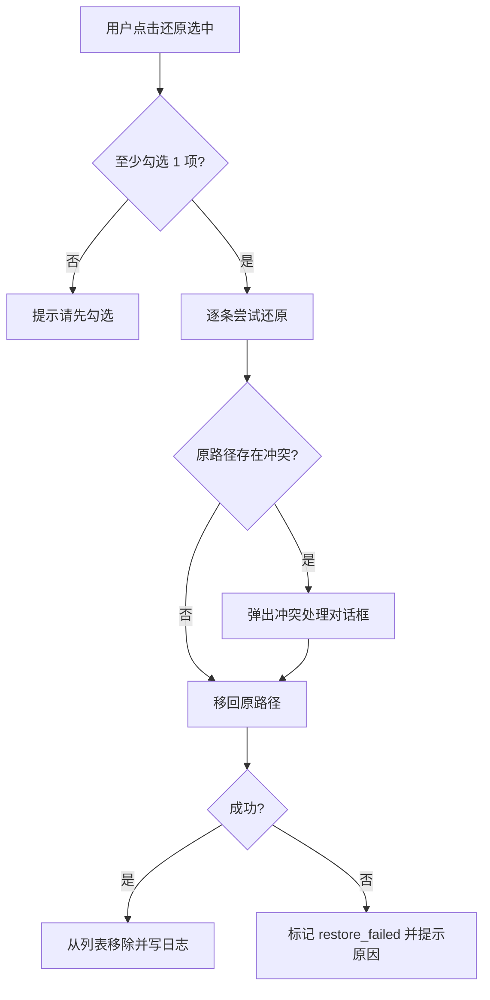
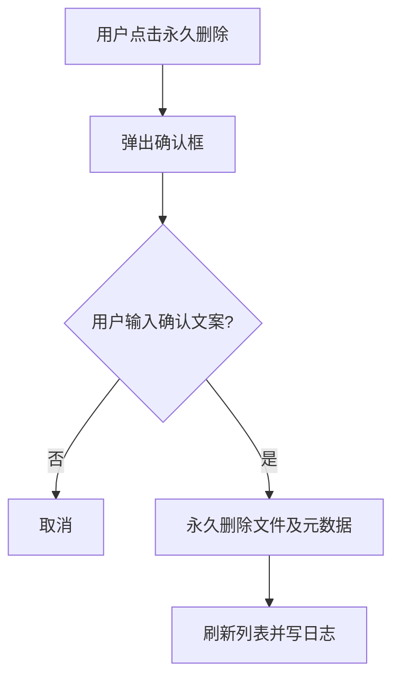

# 隔离区 — 菜单需求文档

| 项目 | 内容 |
|------|------|
| 文档名称 | 隔离区 — 菜单需求文档 |
| 文档版本 | v1.0 |
| 状态 | 未确认 |
| 确认日期 | — |
| 存放路径 | `docs/current/modules/disk-helper/PRD_隔离区.md` |

---

### 功能概述

本页管理**软删除至隔离区**的文件：展示列表、支持**还原**至原路径（或用户指定路径）、**永久删除**，以及查看保留期与占用空间。隔离区是产品「能恢复」能力的核心。

与兄弟页分工：「安全清理」执行移入隔离区；本页负责隔离区内文件的后续管理；与系统回收站相互独立。

### 角色权限

| 维度 | 说明 |
|------|------|
| 数据权限 | 不适用。仅本机隔离区目录数据。 |
| 功能权限 | 个人用户可查看、还原、永久删除；永久删除需二次确认。 |

| 操作 | 个人用户 |
|------|----------|
| 查看隔离区列表 | ✓ |
| 还原文件 | ✓ |
| 永久删除 | ✓（二次确认） |
| 修改隔离区根路径 | —（在设置中配置） |

### 页面结构

```text
┌────────────────────────────────────────────────────────────────────────┐
│ 面包屑：安全清理 > 隔离区          或  设置 > 隔离区（侧边入口）        │
├────────────────────────────────────────────────────────────────────────┤
│ 页标题：隔离区                                                          │
│ 摘要：共 N 项 | 占用 XXX | 隔离区路径：… | 默认保留 N 天               │
├────────────────────────────────────────────────────────────────────────┤
│ 筛选： [全部|即将过期|已过期]     搜索：[路径关键词]                   │
├────────────────────────────────────────────────────────────────────────┤
│ 工具栏：[还原选中] [永久删除选中] [清空已过期]                          │
├────────────────────────────────────────────────────────────────────────┤
│ 列表（可勾选）                                                          │
│  ☐ | 原路径 | 隔离路径 | 大小 | 移入时间 | 过期时间 | 状态              │
├────────────────────────────────────────────────────────────────────────┤
│ 分页（每页 50 条）                                                      │
└────────────────────────────────────────────────────────────────────────┘
```

- 还原冲突时（原路径已存在同名文件），弹出对话框让用户选择「覆盖 / 还原到其它路径 / 取消」。

### 枚举

#### 枚举：隔离项状态

| 存储值 | 展示名 | 说明 |
|--------|--------|------|
| active | 有效 | 在保留期内，可还原 |
| expiring | 即将过期 | 距离过期 ≤ 3 天 |
| expired | 已过期 | 已过保留期，建议清理 |
| restore_failed | 还原失败 | 上次还原失败，保留在隔离区 |

#### 枚举：还原冲突处理

| 存储值 | 展示名 | 说明 |
|--------|--------|------|
| overwrite | 覆盖 | 用隔离区文件覆盖原路径 |
| alternate | 还原到其它路径 | 用户指定新路径 |
| cancel | 取消 | 不执行 |

### 目录树

不适用。

### 查询功能

| 字段名 | 类型 | 必填 | 默认值 | 是否唯一值 | 数据来源 | 说明 |
|--------|------|------|--------|------------|----------|------|
| 状态筛选 | 枚举 | 否 | 全部 | 否 | 用户选择 | 全部 / 即将过期 / 已过期 |
| 路径关键词 | 文本 | 否 | 空 | 否 | 用户输入 | 匹配原路径或隔离路径 |

- 变更筛选或搜索后立即刷新列表。

### 列表展示

#### 隔离区文件列表

| 字段名 | 类型 | 必填 | 默认值 | 是否唯一值 | 数据来源 | 说明 |
|--------|------|------|--------|------------|----------|------|
| 勾选 | 布尔 | 否 | false | 否 | 用户 | — |
| 原路径 | 文本 | 是 | — | 否 | 元数据 | 软删除前绝对路径 |
| 隔离路径 | 文本 | 是 | — | 是 | 元数据 | 隔离区内实际存储路径 |
| 大小 | 容量 | 是 | — | 否 | 元数据 | — |
| 移入时间 | 日期时间 | 是 | — | 否 | 元数据 | — |
| 过期时间 | 日期时间 | 是 | — | 否 | 计算 | 移入时间 + 保留天数 |
| 状态 | 枚举 | 是 | active | 否 | 计算 | 对应「隔离项状态」 |
| 风险等级 | 枚举 | 否 | — | 否 | 元数据 | 移入时记录 |

- 默认按移入时间降序；分页每页 50 条。
- 空列表占位：「隔离区为空，清理的文件将显示在这里」。

### 列表卡片

不适用。

### 工具栏按钮

| 按钮名称 | 主次 | 显隐条件 | 打开方式 | 操作结果 |
|----------|------|----------|----------|----------|
| 还原选中 | 主按钮 | 至少勾选 1 项 active/expiring | 冲突时对话框 | 移回原路径或指定路径；写日志 |
| 永久删除选中 | 次按钮 | 至少勾选 1 项 | 二次确认对话框 | 从磁盘永久删除；不可恢复 |
| 清空已过期 | 次按钮 | 存在 expired 项 | 二次确认 | 永久删除所有 expired 项 |
| 打开隔离区目录 | 次按钮 | 始终 | 系统调用 | 资源管理器打开隔离区根目录 |

### 表单设计

#### 永久删除确认对话框

| 字段名 | 类型 | 必填 | 默认值 | 是否唯一值 | 数据来源 | 说明 |
|--------|------|------|--------|------------|----------|------|
| 删除数量 | 整数 | 是 | — | 否 | 计算 | 只读 |
| 释放空间 | 容量 | 是 | — | 否 | 计算 | 只读 |
| 确认文案 | 文本 | 是 | — | 否 | 用户 | 须输入「永久删除」 |

#### 还原冲突对话框

| 字段名 | 类型 | 必填 | 默认值 | 是否唯一值 | 数据来源 | 说明 |
|--------|------|------|--------|------------|----------|------|
| 冲突处理方式 | 枚举 | 是 | — | 否 | 用户 | overwrite / alternate / cancel |
|  alternate 目标路径 | 文本 | 条件 | — | 否 | 用户 | 选 alternate 时必填 |

### 流程图

#### 还原文件



1. 用户勾选条目并点击「还原选中」。
2. 系统逐条将文件从隔离区移回原路径。
3. 若原路径已有同名项，弹出冲突处理选项。
4. 成功：列表移除该项，操作日志记录还原；失败：保留在隔离区并标记状态。

#### 永久删除



1. 用户选择永久删除并确认。
2. 须输入「永久删除」方可执行。
3. 删除后不可恢复；记录操作日志。

### 导入导出

不适用。

### 数据验证规则

#### 校验范围与场景

永久删除确认；还原冲突 alternate 路径。

#### 正则形态校验（按字段）

##### 永久删除确认文案（purgeConfirmText）

1. **适用场景**：永久删除选中或清空已过期。
2. **正则表达式**：

```regex
^永久删除$
```

3. **错误提示**：请输入「永久删除」以继续。

#### 其它验证规则（非正则）

1. **alternate 路径**：须为 C 盘有效绝对路径；目录须存在或可由系统创建；非法提示「目标路径无效」。
2. **空勾选**：还原/永久删除时未勾选提示「请先勾选项目」。
3. **过期项还原**：expired 项仍可还原（第一版不自动删除）；仅「清空已过期」会永久删除。
4. **隔离区目录不可用**：若隔离区根路径不存在或无权限，页顶错误态并引导至设置。

#### 跨字段与业务规则

1. 保留天数来自「设置」；移入时已写入过期时间，设置变更不影响已有项过期时间。
2. 永久删除不经过系统回收站，不可从回收站恢复。
3. 还原成功后，若「安全清理」建议清单仍含该路径，下次重新生成建议时更新。

#### 规则汇总（验收清单）

1. 软删除进入隔离区的文件正确出现在列表。
2. 还原成功文件回到原路径，日志有记录。
3. 原路径冲突时对话框与三种处理方式有效。
4. 永久删除需确认文案，执行后文件不可恢复。
5. 「清空已过期」仅删除 expired 状态项。
6. 摘要区正确展示项数、占用、路径、保留策略。

### 注意事项

1. 隔离区默认位于 C 盘用户可写目录下；路径在设置中配置，变更不影响已隔离文件位置（除非用户手动迁移）。
2. 第一版不自动后台 purge 过期文件，需用户主动「清空已过期」或永久删除（避免误删）。
3. 文件夹隔离按移入时整体移动处理；还原时保持目录结构。
