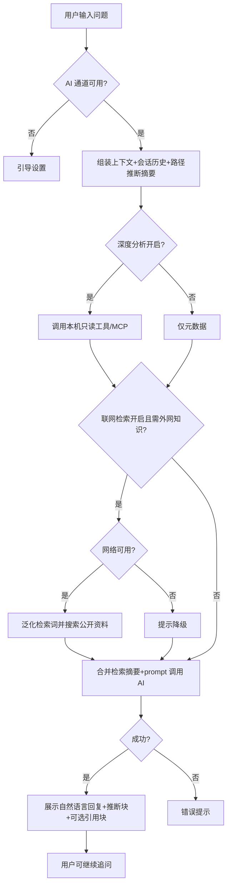

# AI 智能分析 — 菜单需求文档（v1.1）


| 项目   | 内容                                                         |
| ---- | ---------------------------------------------------------- |
| 文档名称 | AI 智能分析 — 菜单需求文档（v1.1）                                     |
| 文档版本 | v1.1                                                       |
| 状态   | 已确认                                                        |
| 确认日期 | 2026-06-23                                                 |
| 存放路径 | `docs/current/modules/disk-helper/v1.1/PRD_AI智能分析_v1.1.md` |


---

### 功能概述

v1.1 在 v1.0「对话式 AI + 脱敏上下文 + 双通道（Ollama/DeepSeek）」基础上 **解放分析能力**：

- **取消固定回复结构**（不再强制「是什么/能否删/影响/恢复」四段式）；AI 以自然语言回答用户问题。
- **支持多轮对话**：同一会话内连续追问，可见本轮历史消息。
- **路径来源推断（必做）**：根据路径模式、扩展名、大小、修改时间、规则说明等，推断文件/目录可能由 **哪个应用、服务或系统组件** 产生，并展示 **置信度（高/中/低）**。
- **深度分析（可选，默认关）**：用户在设置中开启后，AI 可调用 **本机只读工具**（内置或 MCP）获取额外元数据（如文件类型、版本资源、父目录命名规则库匹配）；**文件内容不上传云端**。
- **联网检索（可选，默认关）**：用户在设置中开启后，AI 可调用 **联网搜索工具**（内置或 MCP）检索公开资料（如 Hugging Face、npm、某软件缓存目录说明），将 **摘要结果拼入本地 prompt** 再交给模型回答。**本地 Ollama 模式下推理仍在本机**；仅搜索请求与检索摘要走网络，**不向搜索引擎发送完整本地路径或文件内容**。

与兄弟页分工不变：浏览/清理带入上下文；**实际删除仅在安全清理**由用户确认。规则引擎风险等级仍高于 AI 建议。

### 角色权限


| 维度   | 说明                                                                                       |
| ---- | ---------------------------------------------------------------------------------------- |
| 数据权限 | 不适用。会话与上下文在本机；发送至云端仅为脱敏摘要与对话文本（云端模式）。深度分析工具仅读本机元数据。联网检索仅发送 **经脱敏/泛化后的检索词**，不发送文件内容与完整路径。 |
| 功能权限 | 个人用户可多轮提问、查看推断与置信度；深度分析与联网检索均需在设置中显式开启（默认关）。                                             |


| 操作          | 个人用户                              |
| ----------- | --------------------------------- |
| 多轮提问        | ✓（需 AI 通道可用）                      |
| 查看路径来源推断    | ✓                                 |
| 开启/关闭深度分析   | ✓（设置页，默认关）                        |
| 开启/关闭联网检索   | ✓（设置页，默认关；**本地 Ollama 与云端模式均可用**） |
| 通过 AI 直接删除  | —                                 |
| 要求 AI 绕过危险项 | —                                 |


### 页面结构

```text
┌────────────────────────────────────────────────────────────────────────┐
│ 主导航 … | 分析（当前）| 设置                                          │
├────────────────────────────────────────────────────────────────────────┤
│ 页标题：AI 智能分析  [新对话] [清除上下文]  深度分析/联网检索状态（跳转设置）│
├──────────────────────────────┬─────────────────────────────────────────┤
│ 上下文面板（左栏，可折叠）    │ 对话区（右栏）                           │
│ 【当前上下文】               │ ┌─────────────────────────────────────┐ │
│  - 来源：浏览/清理/手动       │ │ 多轮消息列表（用户/AI，自然排版）     │ │
│  - 路径 + 大小 + 风险         │ │ AI 消息可含「来源推断」标签块         │ │
│  - [推断预览] 可选一行摘要    │ └─────────────────────────────────────┘ │
│ [编辑上下文]                 │ ┌─────────────────────────────────────┐ │
│                              │ │ 输入框 [发送]  Enter发送 Shift+Enter换行│ │
│                              │ └─────────────────────────────────────┘ │
└──────────────────────────────┴─────────────────────────────────────────┘
```

- 未配置 AI 通道时：空状态 + 跳转设置（与 v1.0 类似，支持本地/云端两种模式说明）。
- 深度分析开启时：页标题旁展示「深度分析：开」；关闭时提示「仅基于路径与索引元数据」。
- 联网检索开启时：展示「联网检索：开」；关闭时提示「仅使用模型已有知识与本地推断」。无网络时发送前提示「联网检索不可用，将仅用本地知识回答」。

### 枚举

#### 枚举：上下文来源


| 存储值     | 展示名  | 说明      |
| ------- | ---- | ------- |
| none    | 无    | 无携带项    |
| browse  | 空间浏览 | 从浏览页带入  |
| cleanup | 安全清理 | 从清理清单带入 |
| manual  | 手动添加 | 分析页编辑   |


#### 枚举：推断置信度


| 存储值    | 展示名 | 说明                                     |
| ------ | --- | -------------------------------------- |
| high   | 高   | 路径强匹配已知模式（如 Chrome Cache、Windows Temp） |
| medium | 中   | 部分匹配或需结合扩展名/大小                         |
| low    | 低   | 仅通用推测，须用户自行确认                          |


#### 枚举：深度分析状态


| 存储值         | 展示名 | 说明            |
| ----------- | --- | ------------- |
| off         | 关闭  | 默认；无 MCP/工具调用 |
| on          | 开启  | 允许本机只读工具      |
| unavailable | 不可用 | 工具加载失败，已降级    |


#### 枚举：联网检索状态


| 存储值         | 展示名 | 说明             |
| ----------- | --- | -------------- |
| off         | 关闭  | 默认；不发起外网搜索     |
| on          | 开启  | 允许调用搜索工具/MCP   |
| unavailable | 不可用 | 无网络或搜索服务失败，已降级 |


#### 枚举：消息角色


| 存储值       | 展示名   | 说明    |
| --------- | ----- | ----- |
| user      | 用户    | 用户消息  |
| assistant | AI 助手 | 模型回复  |
| system    | 系统    | 错误或提示 |


### 目录树

不适用。

### 查询功能

不适用。

### 列表展示

#### 上下文条目列表（左栏）


| 字段名  | 类型  | 必填  | 默认值 | 是否唯一值 | 数据来源   | 说明             |
| ---- | --- | --- | --- | ----- | ------ | -------------- |
| 路径摘要 | 文本  | 是   | —   | 否     | 脱敏     | 隐藏用户名段         |
| 大小   | 容量  | 否   | —   | 否     | 索引     | —              |
| 类型   | 文本  | 否   | —   | 否     | 索引     | 文件/文件夹         |
| 风险等级 | 枚举  | 否   | —   | 否     | 规则引擎   | —              |
| 规则说明 | 文本  | 否   | —   | 否     | 规则引擎   | —              |
| 推断预览 | 文本  | 否   | —   | 否     | 本地推断引擎 | 一行来源摘要；v1.1 新增 |


- 上下文上限 **20 条**（与 v1.0 一致）。

#### 对话消息列表（右栏）


| 字段名   | 类型   | 必填  | 默认值 | 是否唯一值 | 数据来源   | 说明                            |
| ----- | ---- | --- | --- | ----- | ------ | ----------------------------- |
| 消息标识  | 文本   | 是   | —   | 是     | 系统     | 对应数据键：messageId               |
| 角色    | 枚举   | 是   | —   | 否     | —      | user/assistant/system         |
| 内容    | 长文本  | 是   | —   | 否     | 用户或 AI | Markdown；**无固定段落标题**          |
| 来源推断块 | 结构化  | 否   | —   | 否     | AI+本地  | 含推断文本、置信度、依据要点                |
| 联网引用块 | 结构化  | 否   | —   | 否     | 搜索摘要   | 含检索摘要要点、来源标题/链接（可选展示）；v1.1 新增 |
| 发送时间  | 日期时间 | 是   | —   | 否     | 系统     | —                             |


- 单会话保留 **最近 50 条**消息（v1.1 自 v1.0 的 100 条调整为 50 条以控内存，可评审调整）。
- 多轮时请求携带 **最近 N 轮**对话（N 默认 10，可配置上限）。

### 列表卡片

不适用。

### 工具栏按钮


| 按钮名称  | 主次  | 显隐条件            | 打开方式              | 操作结果              |
| ----- | --- | --------------- | ----------------- | ----------------- |
| 新对话   | 次按钮 | 始终              | 确认（loading 时提示等待） | 清空消息；可选保留上下文      |
| 清除上下文 | 次按钮 | 上下文非空           | 本页                | 清空左栏              |
| 编辑上下文 | 次按钮 | 始终              | 侧滑                | 手动增删路径            |
| 发送    | 主按钮 | AI 可用且非 loading | 本页                | 提交多轮请求            |
| 停止生成  | 次按钮 | 流式/loading（若支持） | 本页                | 中断当前回复            |
| 前往设置  | 次按钮 | AI 未配置          | 跳转                | 打开 AI/深度分析/联网检索设置 |


#### 设置 — AI 增强（关联设置页，本页只读展示）


| 字段名  | 类型  | 必填  | 默认值 | 是否唯一值 | 数据来源 | 说明                                               |
| ---- | --- | --- | --- | ----- | ---- | ------------------------------------------------ |
| 深度分析 | 开关  | 是   | 关   | —     | 用户   | 对应数据键：ai_deep_analysis_enabled                   |
| 联网检索 | 开关  | 是   | 关   | —     | 用户   | 对应数据键：ai_web_search_enabled；**本地 Ollama 模式同样生效** |


- 首次开启联网检索须二次确认：说明将向搜索引擎发送 **泛化检索词**（不含完整路径与文件内容），检索摘要仅用于本地拼 prompt。
- v1.1 **移除**固定快捷按钮「能删吗」「怎么恢复」；可改为输入框 placeholder 示例，不强制模板问题。

### 表单设计

#### 问题输入区


| 字段名  | 类型  | 必填  | 默认值 | 是否唯一值 | 数据来源 | 说明                 |
| ---- | --- | --- | --- | ----- | ---- | ------------------ |
| 问题内容 | 长文本 | 是   | 空   | 否     | 用户   | 1～4000 字符（v1.1 放宽） |


#### 手动添加上下文（侧滑）


| 字段名 | 类型  | 必填  | 默认值 | 是否唯一值 | 数据来源 | 说明       |
| --- | --- | --- | --- | ----- | ---- | -------- |
| 路径  | 文本  | 是   | —   | 否     | 索引选择 | C 盘已索引路径 |


### 流程图

#### 多轮提问与路径推断




1. 用户输入自然语言问题并发送。
2. 系统校验 AI 通道；失败则引导设置。
3. 对每个上下文路径运行 **本地路径推断**，生成摘要与置信度。
4. 若深度分析开启，调用本机工具补充元数据（超时则降级）。
5. 若联网检索开启，且满足以下 **任一** 条件则触发搜索：路径推断置信度为 **低**；用户问题含「是什么软件/能否删/官方说明」等需外部知识的关键词；或编排层判定本地知识不足。系统将问题与推断结果 **泛化为检索词**（如「Hugging Face hub cache 目录 能否删除 Windows」），**不得**包含 `C:\Users\...` 等完整路径。
6. 搜索成功则将 **摘要**（非整页 HTML）拼入 prompt；失败则降级并提示。
7. 将脱敏上下文、推断结果、检索摘要、**最近对话历史** 与当前问题发送至 AI（**本地 Ollama 时全部在本机拼 prompt 后仅调 Ollama**）。
8. 展示 **非模板化** 回复；可选展示「参考来源」折叠块（标题/链接）。
9. 用户可继续追问，重复步骤 1～8。
10. 回复末尾保留简短免责声明（一行，非四段结构）。

#### 从其它菜单带入上下文

1. 用户在浏览/清理点击「问 AI」。
2. 跳转本页并载入条目；左栏显示推断预览（异步，不阻塞发送）。
3. 用户自由提问。

### 导入导出

不适用。

### 数据验证规则

#### 校验范围与场景

问题输入；手动添加上下文；深度分析工具调用前权限检查；联网检索开关与检索词脱敏。

#### 正则形态校验（按字段）

本页无正则校验字段。

#### 其它验证规则（非正则）

1. 问题长度 1～4000 字符。
2. 上下文 ≤20 条。
3. 手动路径须存在于索引。
4. 发送至云端的 payload：**不得包含**文件二进制/全文；路径脱敏。
5. 深度分析工具：**只读**；禁止删除/移动/执行命令。
6. 联网检索：**仅 HTTPS**；检索词须泛化，禁止含 Windows 用户名、完整绝对路径、文件内容；单次会话搜索次数上限 **5 次**（可配置）。
7. AI 回复 **不得触发** cleanup_execute。
8. 推断为 low 置信度时，UI 展示「请自行确认」提示；若联网检索关闭，提示「可开启联网检索获取公开说明」。

#### 跨字段与业务规则

1. 规则引擎风险与 AI 建议冲突时，展示提示条：「请以安全清理中的风险等级为准」。
2. 深度分析默认 **关闭**；首次开启需二次说明（隐私与性能）。
3. 联网检索默认 **关闭**；首次开启需说明「检索词会发往搜索服务」；**本地 Ollama 模式下同样可用**，模型推理仍在本机。
4. 操作日志记录 ai_query 成功与否、是否启用深度分析、**是否触发联网检索**（不记检索词全文与完整对话）。

#### 规则汇总（验收清单）

1. 多轮追问 3 次以上上下文连贯。
2. 对 Chrome/Temp/Downloads 等样例路径能给出合理来源推断 + 置信度。
3. 深度分析关闭时无 MCP 调用。
4. 深度分析开启时本机工具失败可降级，不白屏。
5. 联网检索开启、本地 Ollama 模式：对 Hugging Face 缓存路径样例能结合 **检索摘要** 给出非空泛化说明（验收用例见产品概要 AC-04b）。
6. 联网检索关闭时不发起外网请求。
7. 回复无强制四段标题。
8. 不能通过 AI 直接删除文件。

### 注意事项

1. **MCP 为可选实现路径**：若首期不接入 MCP，须实现等价的 **内置只读工具**（路径知识库 + 元数据读取）以满足「详细分析」最低标准；联网检索同理，须 **内置搜索客户端** 或 MCP 搜索工具至少一种。
2. 云端 API 仍只接收脱敏文本；深度分析与联网检索结果在 **本地拼进 prompt** 后再决定是否发送摘要至云端。
3. **本地 Ollama 模式**：推理在本机；联网检索仅用于获取公开资料摘要，**不改变「模型在本地运行」** 的定位。
4. v1.1 不要求 AI 读取文件内容全文；若用户需要「看文件头」，仅深度分析模式下读取 **有限字节** 且不上云、不用于搜索。
5. 联网检索典型场景：冷门开发工具目录（如 Hugging Face、Conda、Gradle）、新版本软件缓存说明；与本地路径推断 **互补**，推断为 high 时可跳过搜索以省流量。

