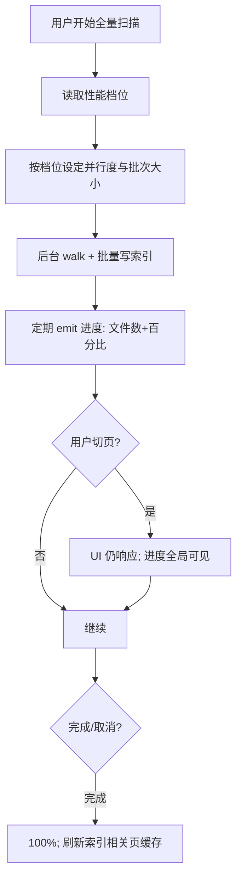

# 性能与体验优化 — 菜单需求文档（v1.1）

| 项目 | 内容 |
|------|------|
| 文档名称 | 性能与体验优化 — 菜单需求文档（v1.1） |
| 文档版本 | v1.1 |
| 状态 | 已确认 |
| 确认日期 | 2026-06-23 |
| 存放路径 | `docs/current/modules/disk-helper/v1.1/PRD_性能与体验_v1.1.md` |

> 本文档为 **跨菜单** 能力需求，主要影响：磁盘总览（扫描）、空间浏览、安全清理、隔离区、设置。v1.0 各菜单 PRD 仍然有效，本节为 v1.1 增量约束。

---

### 功能概述

解决 v1.0 用户反馈：**全量扫描时 CPU/内存占用高、风扇加速、应用卡顿**；**清理/隔离区等页面加载慢、无 loading 反馈**。v1.1 目标是在 **不降低索引正确性** 前提下，降低资源峰值、缩短可感知等待，并在长任务期间保持 UI 可交互。

### 角色权限

| 维度 | 说明 |
|------|------|
| 数据权限 | 不适用 |
| 功能权限 | 个人用户可在设置中选择扫描性能档位；其余为系统自动优化 |

| 操作 | 个人用户 |
|------|----------|
| 选择扫描性能档位 | ✓（设置 → 扫描） |
| 扫描中切换页面 | ✓ |
| 扫描中暂停/取消 | ✓ |
| 查看 loading/进度 | ✓ |

### 页面结构

本需求不新增独立菜单，影响范围如下：

```text
┌─ 磁盘总览 ─────────────────────────────────────────┐
│ 扫描状态条：进度% + 已扫描文件数 + 暂停/取消          │
│ （v1.1：进度与文件数同步；扫描中可离开本页）          │
└────────────────────────────────────────────────────┘
         │
         ▼
┌─ 空间浏览 / 安全清理 / 隔离区 ─────────────────────┐
│ 首屏：loading 动画 + 「加载中…」文案                 │
│ 列表：分页（默认 50 条/页）；避免一次渲染全量         │
│ 清理：建议列表 IPC 后台执行 + 结果缓存               │
└────────────────────────────────────────────────────┘
         │
         ▼
┌─ 设置 → 扫描 ──────────────────────────────────────┐
│ 扫描性能档位：平衡（默认）/ 低占用 / 高速（可选）     │
│ 说明：低占用降低并行与批次，风扇/内存更友好           │
└────────────────────────────────────────────────────┘
```

### 枚举

#### 枚举：扫描性能档位

| 存储值 | 展示名 | 说明 |
|--------|--------|------|
| balanced | 平衡 | 默认；与 v1.0 接近但经 v1.1 内存优化 |
| low_impact | 低占用 | 降低并行 walk 线程、减小 DB 批次、拉长 flush 间隔 |
| fast | 高速 | 可选；更高并行，仅推荐空闲时（v1.1 可只做两档） |

#### 枚举：页面加载状态

| 存储值 | 展示名 | 说明 |
|--------|--------|------|
| idle | 空闲 | 未请求 |
| loading | 加载中 | 首次请求 |
| refreshing | 更新中 | 有缓存时的后台刷新 |
| ready | 就绪 | 已展示数据 |
| error | 失败 | 可重试 |

### 目录树

不适用（性能需求不单独定义树；浏览页树懒加载规则仍见 v1.0 PRD）。

### 查询功能

不适用。

### 列表展示

#### 受影响的列表场景

| 场景 | 菜单 | v1.1 要求 |
|------|------|-----------|
| 清理建议列表 | 安全清理 | 分页；首屏 loading；二次打开缓存 ≤2s |
| 隔离区列表 | 隔离区 | 分页；loading；stale 缓存 30s |
| 大文件 Top | 空间浏览 | 首屏 ≤1s（索引就绪） |
| 扫描进度 | 磁盘总览 | 展示文件数 + 百分比；偏差 ≤10% |

### 列表卡片

不适用。

### 工具栏按钮

| 按钮名称 | 主次 | 显隐条件 | 打开方式 | 操作结果 |
|----------|------|----------|----------|----------|
| 重试 | 次按钮 | 页面 error 状态 | 本页 | 重新请求数据 |
| 暂停扫描 | 次按钮 | 扫描 running | 总览/全局状态条 | 暂停 walk |
| 取消扫描 | 次按钮 | 扫描 running/paused | 同上 | 取消任务 |

### 表单设计

#### 设置 — 扫描性能档位

| 字段名 | 类型 | 必填 | 默认值 | 是否唯一值 | 数据来源 | 说明 |
|--------|------|------|--------|------------|----------|------|
| 扫描性能档位 | 单选 | 是 | 平衡 | 是 | 用户选择 | 对应数据键：scan_performance_profile |

- 变更后立即持久化；**下次扫描**生效，不中断当前扫描。

### 流程图

#### 全量扫描（低占用模式）



1. 用户启动扫描；系统读取档位参数。
2. 扫描在后台线程执行，IPC **不长时间阻塞** UI 线程。
3. 进度条分母优先使用 **上次完成扫描文件数**；无基准时用保守曲线，并 prominently 展示 **已扫描文件数**。
4. 用户可切换至清理/隔离区；对应页展示 loading 或 stale 数据，不得整窗假死。
5. 完成后使清理建议等缓存失效并重建。

#### 清理建议加载

1. 用户打开清理页 → 立即展示 loading。
2. 后端按规则路径 **SQL 前缀过滤** + **内存缓存**（索引代际变化时失效）。
3. 首屏返回分页数据；筛选/翻页使用缓存或增量过滤。
4. 若超过 2s 未完成，保持 loading 并允许用户切换筛选（debounce）。

### 导入导出

不适用。

### 数据验证规则

#### 校验范围与场景

扫描档位保存；性能相关设置项。

#### 正则形态校验（按字段）

本页无正则校验字段。

#### 其它验证规则（非正则）

1. 扫描档位枚举值合法。
2. 扫描进行中修改档位：提示「将在下次扫描生效」。
3. 低占用模式下并行线程数 **≥1** 且 **≤ CPU 核心数的一半**（业务规则，实现可调）。
4. 单批次 DB 写入条数有上限，防止内存尖峰。
5. 列表单页最大 100 条，默认 50。

#### 跨字段与业务规则

1. 性能优化 **不得** 跳过已索引文件的必要字段（路径、大小、风险计算仍正确）。
2. 清理建议缓存须在 **索引变更、扫描完成、清空索引** 时失效。
3. 路由级页面 **懒加载**（v1.1 要求保持），减少首包体积。

#### 规则汇总（验收清单）

1. 全量扫描时任务管理器可见内存峰值较 v1.0 下降 ≥30%（同机对比）。
2. 扫描中切换至清理页 ≤5s 内出现 loading 或内容，应用未未响应。
3. 进度条与「已扫描 N 个文件」大致一致（有基准时偏差 ≤10%）。
4. 清理页二次打开 P95 ≤2s。
5. 隔离区首屏 P95 ≤1s（分页 50）。
6. 所有受影响列表页在 loading 时有明确动画或文案。

### 注意事项

1. 「高速」档位为可选项；若实现成本过高，v1.1 可仅交付 **平衡 + 低占用** 两档。
2. 性能指标以 **开发者本机 C 盘** 为主要验收环境，需在验收清单记录机器配置。
3. 与 AI v1.1 深度分析同时开启时，扫描仍优先保证 UI 响应（AI 工具调用不应与 scan walk 争抢同一满负载 CPU 策略——实现阶段可串行或降优先级）。
