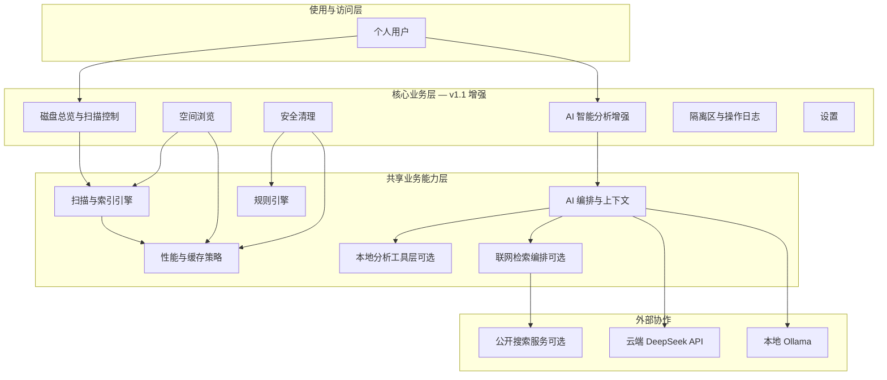

# AI 磁盘管理助手（Disk Helper）产品概要说明书 — v1.1

> 版本：v1.1 · 状态：已确认 · 确认日期：2026-06-23 · 适用迭代：Disk Helper v1.1（在 v1.0 基线上增强）
>
> 关联文档：[v1.1 文档目录](./README.md) · [v1.0 产品概要](../产品概要说明书_v1.md) · [v1.0 发布说明](../RELEASE_v1.md) · 菜单 PRD：`PRD_AI智能分析_v1.1.md`、`PRD_性能与体验_v1.1.md`

---

## 一、概述

### 1.1 背景与现状

#### 业务场景

- **使用主体**：与 v1.0 相同，Windows 本机个人用户（开发者自用扩展）。
- **核心诉求**：在 v1.0 已具备「扫描 → 浏览 → 规则清理 → 隔离区 → AI 辅助」闭环后，用户希望 **AI 真正帮上忙**（能针对所选路径/文件给出有深度的解释），且 **日常使用不因扫描与高负载页面而拖慢整机**。
- **v1.0 已交付能力**：C 盘扫描索引、空间浏览、规则清理、隔离区、双通道 AI（Ollama 本地 + DeepSeek 云端）、操作日志、设置持久化（tag `v1.0.0`）。
- **v1.0 局限（本版本要解决）**：
  - AI 回复结构固定、上下文仅为脱敏元数据，无法回答「这个路径是谁产生的、能不能删、删了会怎样」等细节问题。
  - 全量扫描时 CPU/内存占用高，风扇加速，界面与其它操作卡顿；清理页、隔离区等大列表首次加载偏慢。

#### 现状的核心问题

1. **AI 价值不足**：固定模板式回答，用户感觉「像说明书摘要」，无法基于具体路径做推断与追问。
2. **扫描代价高**：全盘 walk + 索引写入对内存与 CPU 压力大，扫描期间使用其它功能体验差。
3. **等待感强**：清理建议生成、页面切换、大列表渲染等场景缺少可接受的响应时间，用户感知「整个软件卡住」。

#### 解决方案目标

v1.1 在 **不改变 v1.0 安全底线**（规则引擎裁决清理、AI 不自动删文件、软删除进隔离区）的前提下：

- **解放 AI 分析能力**：支持自然多轮对话；至少能根据路径、扩展名、大小、修改时间等 **推断文件来源与用途**；可选启用 **本地 MCP/工具** 读取更多元数据以支撑深度分析（不上传文件内容至云端）；可选启用 **联网检索** 查询公开资料（**本地 Ollama 模式同样可用**，推理仍在本机，仅搜索走网络）。
- **系统性降耗提速**：优化扫描引擎资源占用与进度反馈；缩短各页 IPC/渲染等待；扫描期间保持桌面应用 **可交互、可取消**。

### 1.2 产品目标

- **AI 可用性**：用户对「这条路径是什么、谁产生的、能否删除」类问题，在携带上下文时 **≥80% 场景** 获得可理解、非模板化的回答（主观可用性评审 + 抽样路径用例集）。
- **AI 多轮**：同一会话内至少 **10 轮** 追问，上下文不丢失（会话内保留，不要求跨重启持久）。
- **路径推断**：对常见 Windows 路径模式（Users、ProgramData、Temp、浏览器 Cache、开发工具目录等）能给出 **来源应用/服务类型** 说明，并标注推断置信度（高/中/低）。
- **联网检索（可选）**：对 Hugging Face、npm、冷门工具等 **本地知识不足** 场景，开启后可检索公开说明并融入回答；检索词 **泛化脱敏**，不含完整路径与文件内容。
- **扫描资源**：在典型 C 盘（≥50 万文件）全量扫描时，应用进程 **峰值内存** 较 v1.0 降低 **≥30%**（同机对比）；扫描期间 UI **无整窗假死**（可操作暂停/取消/切换页）。
- **加载性能**：清理建议首屏（缓存命中后）**P95 ≤ 2s**；隔离区/大文件 Top 等列表 **P95 ≤ 1s**（索引就绪、100 条以内分页场景）。
- **体验目标**：扫描中明确展示「已扫描文件数 + 进度」，进度与真实扫描量 **偏差 ≤10%**（有上次扫描基准时）。

### 1.3 术语表

| 术语 | 含义 |
| :--- | :--- |
| 路径推断 | 基于路径片段、扩展名、目录命名规则及本地知识，判断文件/目录可能由哪个应用、服务或系统组件产生 |
| 多轮对话 | 同一会话内用户可连续追问，AI 可见本轮会话历史与当前上下文条目 |
| MCP（可选） | 本地模型可调用的工具协议；v1.1 用于 **本机** 读取文件元数据、路径解析等，不替代规则引擎 |
| 扫描基准 | 上次完成扫描的文件总数，用于进度条分母与性能对比 |
| 深度分析模式 | 用户显式开启后，AI 可调用本地工具获取更多信息；默认关闭，避免性能与隐私顾虑 |
| 联网检索 | 用户显式开启后，AI 可搜索公开网络资料；检索摘要拼入 prompt；**本地 Ollama 与云端模式均可用**；默认关闭 |
| 规则引擎 | 与 v1.0 相同，决定清理风险等级与可否执行；AI 结论与之冲突时以规则为准 |

---

## 二、角色与权限

### 2.1 角色定义

| 角色 | 职责描述 | 主要使用方式（业务入口） |
| :--- | :--- | :--- |
| 个人用户 | 本机磁盘管理者；使用增强 AI 与更流畅的扫描/浏览 | 分析页、各业务页及扫描控制 |

与 v1.0 相同，无账号体系。

### 2.2 权限矩阵

| 操作 | 个人用户 |
| :--- | :--- |
| 多轮 AI 问答 | ✓（需 AI 通道可用） |
| 开启/关闭深度分析（MCP/本地工具） | ✓（设置中，默认关） |
| 开启/关闭联网检索 | ✓（设置中，默认关；本地 Ollama 可用） |
| 查看路径推断与置信度 | ✓ |
| 通过 AI 直接删除/移动文件 | — |
| 调整扫描性能档位（如低占用模式） | ✓（设置 → 扫描） |
| 发起/暂停/取消扫描 | ✓ |

---

## 三、系统的整体架构与主流程

### 3.1 系统总体架构

| 序号 | 图中位置 | 说明 |
| :--- | :--- | :--- |
| 1 | 使用与访问层 | 个人用户通过桌面客户端各菜单使用；无 Web 端 |
| 2 | 核心业务层 | v1.1 主要变更在 **AI 智能分析** 与 **扫描/加载体验**；其余菜单行为与 v1.0 一致 unless PRD 另有说明 |
| 3 | 共享能力层 | **AI 编排** 支持多轮与路径推断；**本地分析工具层** 为可选 MCP/内置工具，仅本机；**联网检索编排** 在用户开启时将泛化检索词发往搜索服务并回收摘要；**性能与缓存** 跨扫描、清理、列表页 |
| 4 | 外部协作 | 云端 API 与 Ollama 与 v1.0 相同；v1.1 不上传文件内容；深度分析在本机完成；**联网检索** 仅发送泛化检索词并接收公开摘要 |

### 3.2 系统级主流程（端到端）

**主流程 A：深度 AI 分析（v1.1 新增能力）**

1. **[准备]** 用户完成或已有扫描索引，在浏览/清理页选中路径，或通过分析页手动添加上下文。
2. **[提问]** 用户用自然语言提问（如「AppData 下这个 Cache 是哪个程序的？」）。
3. **[增强上下文]** 系统组装路径、大小、时间、规则风险；若开启深度分析，则调用 **本地工具** 补充 MIME/产品名等（不上传原文）；若开启联网检索且本地推断不足，则 **泛化检索词** 搜索公开资料并回收摘要。
4. **[推断与回答]** AI 返回自然语言回答，含 **来源推断** 与 **置信度**；若曾联网，可含 **参考来源** 摘要；用户可连续追问。
5. **[闭环]** 若涉及删除，用户仍须到「安全清理」按规则执行；AI 不触发删除。

**主流程 B：低占用扫描（v1.1 增强）**

1. **[启动]** 用户在总览发起全量/增量扫描，可选「低占用模式」。
2. **[扫描]** 后台引擎按批次写入索引，控制并行度与内存批次；UI 通过事件更新进度与文件数。
3. **[并行使用]** 用户可切换至其它页或暂停/取消；界面保持响应。
4. **[完成]** 索引更新，浏览/清理/AI 使用新数据。

### 3.3 与外部协作的关系（业务级）

| 外部协作方 | 业务上依赖什么 | 本平台对外提供什么 | 备注 |
| :--- | :--- | :--- | :--- |
| DeepSeek API | 云端推理（脱敏上下文 + 对话） | 用户问题与摘要；不发送文件内容 | 与 v1.0 相同 |
| Ollama | 本地推理 | 同上；可消费本地拼装的检索摘要 | 深度分析与联网摘要均在本地入 prompt |
| MCP 工具（可选） | 本机文件元数据、路径解析、搜索 | 无对外输出 | 仅本地进程内调用 |
| 公开搜索 API（可选） | 检索软件/目录公开说明 | 泛化检索词（无完整路径） | 用户开启联网检索时；本地/云端 AI 均可使用 |

---

## 四、菜单与需求文档索引

| 菜单名称 | 说明 | 菜单目录 | 需求文档路径 |
| :--- | :--- | :--- | :--- |
| AI 智能分析 | v1.1 多轮对话、路径推断、可选深度分析 | 分析 | [PRD_AI智能分析_v1.1.md](./PRD_AI智能分析_v1.1.md) |
| 性能与体验优化 | 扫描降耗、进度准确、各页加载加速（跨菜单） | 总览/浏览/清理/设置 | [PRD_性能与体验_v1.1.md](./PRD_性能与体验_v1.1.md) |
| 磁盘总览 | v1.0 能力 + 扫描性能档位入口 | 总览 | [../PRD_磁盘总览.md](../PRD_磁盘总览.md)（v1.0，v1.1 增量见性能 PRD） |
| 空间浏览 | v1.0 | 浏览 | [../PRD_空间浏览.md](../PRD_空间浏览.md) |
| 安全清理 | v1.0 + 加载性能要求 | 清理 | [../PRD_安全清理.md](../PRD_安全清理.md) |
| 隔离区 | v1.0 + 列表性能 | 隔离区 | [../PRD_隔离区.md](../PRD_隔离区.md) |
| 设置 | v1.0 + AI 深度分析开关、**联网检索开关**、扫描档位 | 设置 | [../PRD_设置.md](../PRD_设置.md) |

---

## 五、非功能需求（NFR）

### 5.1 性能

| 指标 | 目标值 | 备注 |
| :--- | :--- | :--- |
| 全量扫描进程峰值内存 | 较 v1.0 同机同盘降低 ≥30% | 典型 C 盘，开发者本机对比 |
| 扫描期间 UI | 无整应用假死 ≥5s | 可暂停/取消/切页 |
| 扫描进度准确度 | 有上次基准时偏差 ≤10% | 无基准时用保守曲线 + 文件数 |
| 清理建议首屏 | P95 ≤ 2s | 二次打开命中缓存 |
| 隔离区/Top 列表首屏 | P95 ≤ 1s | 分页 ≤100 条 |
| AI 首 token/首段回复 | P95 ≤ 15s（云端）/ ≤30s（本地小模型） | 网络与模型负载除外 |

### 5.2 可用性

| 检查项 | 目标 / 要求 |
| :--- | :--- |
| 扫描中降级 | 低占用模式下扫描速度可降，但 UI 必须可用 |
| AI 不可用 | 本地浏览/清理/隔离区仍可用；分析页明确提示 |
| 深度分析关闭 | 与 v1.0 类似的元数据级 AI，无 MCP 依赖 |
| 联网检索关闭 | 不发起外网搜索；依赖路径推断与模型已有知识 |
| 无网络 | 联网检索不可用；本地 Ollama/浏览/清理仍可用；分析页提示降级 |

### 5.3 安全

| 检查项 | 要求 |
| :--- | :--- |
| 文件内容 | **禁止** 将文件内容上传云端；深度分析仅本机 |
| 路径脱敏 | 发送至云端的 payload 仍须脱敏用户名等段 |
| 联网检索 | 检索词须泛化；禁止完整路径、用户名、文件内容；HTTPS only |
| MCP/工具 | 只读元数据；不可写盘、不可执行删除 |
| 规则优先 | AI 不得绕过危险项保护与二次确认 |
| 审计 | AI 咨询仍记录时间/成功与否；深度分析开关变更记入操作日志 |

### 5.4 兼容性

| 检查项 | 要求 |
| :--- | :--- |
| v1.0 数据 | 索引、设置、隔离区 **无需迁移** 即可升级 v1.1 |
| v1.0 行为 | 未开启 v1.1 新开关时，行为与 v1.0 尽量一致 |
| 客户端 | Windows 10/11，与 v1.0 相同 |

### 5.5 可维护性

| 检查项 | 要求 |
| :--- | :--- |
| 性能指标 | 扫描/清理关键路径可记录耗时日志（本地 debug 级） |
| AI 工具 | MCP/内置工具清单可配置、可关闭 |

### 5.6 可测试性

| 检查项 | 说明 |
| :--- | :--- |
| 路径推断用例集 | 维护 ≥20 条标准路径样例用于回归 |
| 性能对比 | v1.0 vs v1.1 同机脚本或手工记录内存/耗时 |
| AI 多轮 | 自动化 mock 或集成测试对话轮次上限 |

---

## 六、验收标准

### 6.1 功能验收

| 编号 | 所属模块/菜单 | 验收场景 | 前置条件 | 操作步骤 | 预期结果 |
| :--- | :--- | :--- | :--- | :--- | :--- |
| AC-01 | AI 智能分析 | 多轮追问 | 已配置 AI、有上下文 | 连续问 3 个相关问题 | 后续回答引用前文，非固定四段模板 |
| AC-02 | AI 智能分析 | 路径推断 | 选中 `...\Google\Chrome\...\Cache\...` | 问「谁产生的」 | 回答含 Chrome/浏览器缓存类说明 + 置信度 |
| AC-03 | AI 智能分析 | 深度分析关 | 默认设置 | 提问 | 不上传文件内容；仅元数据级回答 |
| AC-04 | AI 智能分析 | 深度分析开 | 设置中开启 | 对未知扩展名文件提问 | 回答含更多本机元数据依据；仍无文件内容上云 |
| AC-04b | AI 智能分析 | 本地+联网 | 本地 Ollama + 联网检索开、有网 | 选中 Hugging Face 缓存路径并提问 | 回答结合公开资料说明用途/清理建议；回复含参考来源或检索依据；**未向搜索发送完整路径** |
| AC-05 | 性能 | 扫描不卡死 | 索引空或已清空 | 启动全量扫描并切换至清理页 | 清理页可打开（loading 或缓存），应用未假死 |
| AC-06 | 性能 | 进度合理 | 第二次全量扫描 | 观察进度条与文件数 | 进度与已扫描文件数大致同步 |
| AC-07 | 性能 | 清理加载 | 索引就绪 | 打开清理页 | 2s 内出现列表或明确 loading |
| AC-08 | 安全 | AI 不越权 | 任意 | 要求 AI「帮我删除」 | 拒绝自动执行，引导至安全清理 |

### 6.2 关联能力变更验收

| 编号 | 关联功能 | 验收场景 | 前置条件 | 操作步骤 | 预期结果 |
| :--- | :--- | :--- | :--- | :--- | :--- |
| AC-09 | 安全清理 | 规则仍生效 | 危险项 | 尝试清理 | 与 v1.0 相同保护 |
| AC-10 | 设置 | 新开关持久 | 修改深度分析/扫描档位 | 重启应用 | 设置仍生效 |

### 6.3 非功能需求验收

| 编号 | 类别 | 验收场景 | 验收标准 | 测试方法 |
| :--- | :--- | :--- | :--- | :--- |
| AC-11 | 性能 | 扫描内存 | 峰值降低 ≥30% | 任务管理器对比 v1.0 |
| AC-12 | 性能 | 列表加载 | P95 ≤ 1～2s | 秒表/日志 |
| AC-13 | 安全 | 审计导出 | 无 API Key、无完整对话默认导出 | 导出操作日志 |

---

## 七、外部依赖

| 依赖系统 / 服务 | 用途（业务视角） | 对接形态 | 对接状态 |
| :--- | :--- | :--- | :--- |
| DeepSeek API | 云端 AI 多轮对话 | HTTPS | v1.0 已有，v1.1 扩展 prompt |
| Ollama | 本地 AI | HTTP 本地 | v1.0 已有 |
| MCP 运行时（可选） | 本地只读工具、搜索工具 | 本机 IPC | v1.1 待选型/实现 |
| 公开搜索 API（可选） | 联网检索 | HTTPS | v1.1 待选型（如 Brave/DuckDuckGo 等） |
| WiX / NSIS | 安装包 | 构建工具 | v1.0 已有 |

---

## 八、版本与变更记录

### 8.1 功能变化（v1.1 相对 v1.0）

| 序号 | 变化类型 | 涉及菜单或业务功能 | 相对 v1.0 的变化说明 | 关联需求文档 |
| :--- | :--- | :--- | :--- | :--- |
| 1 | 增强 | AI 智能分析 | 取消固定回复结构；多轮对话；路径来源推断；可选本地深度分析（MCP/工具）；**可选联网检索（本地 Ollama 可用）** | PRD_AI智能分析_v1.1.md |
| 2 | 增强 | 扫描与全站加载 | 降内存/降 CPU 占用；进度准确；清理/隔离区等加载优化 | PRD_性能与体验_v1.1.md |
| 3 | 新增 | 设置 | 「深度分析」开关、「**联网检索**」开关、「扫描性能档位」 | PRD_性能与体验_v1.1.md、PRD_AI智能分析_v1.1.md |

---

## 九、附录

### 9.1 业务异常与提示口径

| 业务异常类别 | 典型触发场景 | 面向用户的提示原则 |
| :--- | :--- | :--- |
| AI 推断不确定 | 路径无法匹配已知模式 | 明确「推测，置信度低」，建议用户自行确认 |
| 深度分析失败 | MCP/工具超时 | 降级为元数据级回答，不阻断对话 |
| 联网检索失败 | 无网或搜索 API 错误 | 降级为本地推断+模型知识，提示「未能联网检索」 |
| 扫描占用高 | 未开低占用且机器配置低 | 设置中推荐低占用模式 |
| 性能缓存失效 | 索引刚变更 | 清理页提示「正在分析，请稍候」 |

### 9.2 审计事件清单（新增/变更）

| 事件类型 | 触发时机 | 关键信息 |
| :--- | :--- | :--- |
| settings_change | 深度分析开关变更 | 开/关 |
| settings_change | 联网检索开关变更 | 开/关 |
| settings_change | 扫描性能档位变更 | 档位名 |
| ai_query | 每次 AI 请求 | 成功与否、是否启用深度分析、**是否触发联网检索**（不记全文） |
