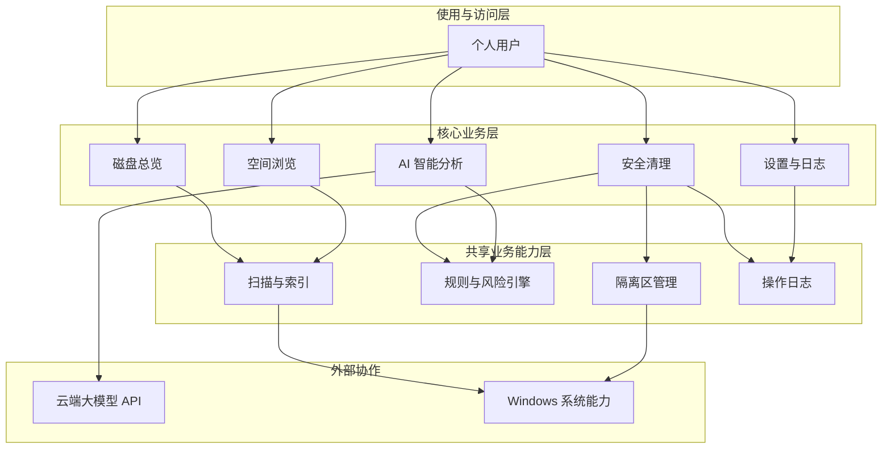

# AI 磁盘管理助手（Disk Helper）产品概要说明书

> 版本：v1.0 · 状态：已确认（功能范围 / 仅 C 盘 / 单一 API Provider）· 适用迭代：第一版（自用本地客户端）
>
> 关联文档：PRD_*.md（菜单需求）、`详细设计_v1.md`（技术详细设计）、`docs/superpowers/plans/2026-06-22-disk-helper-v1.md`（实现计划）

---

## 一、概述

### 1.1 背景与现状

#### 业务场景

- **使用主体**：个人电脑使用者（第一版为开发者本人自用，Windows 环境为主）。
- **核心诉求**：在 C 盘空间不足时，能够**看懂**磁盘占用、**安全地**清理无用文件，并在误操作时**知道如何恢复**；希望有 AI 辅助解释与决策，而不是仅凭数字自行猜测。
- **现有方案及局限**：
  - Windows「存储感知」、磁盘清理：规则固定，对大文件与深层目录的可读性不足，缺少「能否删、删了会怎样」的说明。
  - TreeSize、WinDirStat 等：空间可视化较好，但不提供风险分级、隔离删除与 AI 解释能力。
  - 手动清理：担心误删系统或程序文件，不敢动手；清理后缺少恢复指引。

#### 现状的核心问题

1. **空间看不清**：C 盘目录层级深、缓存分散，难以快速定位「真正占空间的大头」。
2. **不敢删**：大文件是否为系统/程序所需无法判断，担心清理后软件或系统异常。
3. **删了难恢复**：缺少「先隔离、再确认、可回滚」的机制，误删后不知从何恢复。
4. **决策成本高**：需要在多个工具间切换，缺少统一的「浏览 → 分析 → 清理 → 记录」闭环。

#### 解决方案目标

提供一款**纯本地运行的桌面客户端**（方案 A），在本地完成磁盘扫描、索引与文件操作，保障数据不上传云端；同时通过**可配置的云端 AI API** 对选中内容做智能解释与清理建议。产品以「可读的空间浏览 + 规则驱动的安全分级 + 隔离区软删除 + AI 辅助决策」为核心，帮助用户在 C 盘空间管理上建立**看懂、敢删、能恢复**的闭环。第一版聚焦单用户自用，架构上预留后续 Spring 服务端（用户库、规则库、多设备）扩展能力，但不在 v1 实现。

### 1.2 产品目标

- **空间可读**：用户可在 3 分钟内从总览定位到 C 盘 Top 占用目录或大文件（完成首次全量扫描后）。
- **安全清理**：所有「建议删除」项均带风险等级（安全 / 谨慎 / 危险）；危险项默认不可一键删除，需二次确认。
- **可恢复**：支持隔离区软删除，保留期内可一键还原；关键操作写入本地日志。
- **AI 辅助**：用户可对选中文件/目录或清理清单发起 AI 问答，获得「是什么、能否删、影响什么、如何恢复」的解释（依赖网络与 API Key）。
- **离线可用**：无网络时，磁盘浏览、扫描、按规则清理、隔离区与日志功能仍可用；仅 AI 对话不可用。
- **体验目标**：现代化、简洁美观的单窗口桌面应用，支持深色/浅色主题。

### 1.3 术语表

| 术语    | 含义                                            |
| ----- | --------------------------------------------- |
| 扫描    | 遍历指定磁盘（第一版默认 C 盘）目录，统计文件/文件夹大小并写入本地索引的过程      |
| 索引    | 保存在本地的扫描结果数据，用于快速查询、排序与展示，支持增量更新              |
| 全量扫描  | 从头遍历目录并重建或更新索引                                |
| 增量扫描  | 在已有索引基础上，仅更新变更部分，缩短等待时间                       |
| 空间浏览  | 以目录树、Treemap 方块图、大文件/大文件夹榜单等形式展示占用情况          |
| 风险等级  | 对文件/目录的可清理性评估：安全（🟢）、谨慎（🟡）、危险（🔴）            |
| 规则引擎  | 基于路径、类型、名称等内置规则进行风险分级与清理建议，**不依赖 AI 做最终安全裁决** |
| 隔离区   | 本地专用目录，删除操作先将文件移入此处并保留元数据，到期前可还原              |
| 软删除   | 文件移入隔离区或系统回收站，而非立即永久删除                        |
| AI 分析 | 将脱敏后的文件摘要与规则结论发送至云端大模型 API，返回自然语言解释与建议        |
| 操作日志  | 记录扫描、清理、隔离、还原等行为的本地审计记录                       |

---

## 二、角色与权限

### 2.1 角色定义

| 角色   | 职责描述                         | 主要使用方式（业务入口） |
| ---- | ---------------------------- | ------------ |
| 个人用户 | 本机磁盘空间的管理者；发起扫描、浏览、清理与 AI 咨询 | 桌面客户端各功能页    |

第一版为单用户本地应用，无账号体系；所有能力对本机唯一用户开放。

### 2.2 权限矩阵

| 操作                          | 个人用户                  |
| --------------------------- | --------------------- |
| 查看磁盘总览与空间浏览                 | ✓                     |
| 发起/暂停/取消扫描                  | ✓                     |
| 查看风险分级与清理建议                 | ✓                     |
| 执行软删除（移入隔离区/回收站）            | ✓                     |
| 从隔离区还原                      | ✓                     |
| 永久删除隔离区内容                   | ✓（需二次确认）              |
| 使用 AI 分析对话                  | ✓（需已配置 API Key 且网络可用） |
| 修改应用设置（API Key、隔离区路径、保留天数等） | ✓                     |
| 以管理员权限扫描系统目录                | ✓（可选，需系统 UAC 授权）      |

---

## 三、系统的整体架构与主流程

> 本章从**业务与能力**角度描述，不涉及具体技术框架与接口实现。

### 3.1 系统总体架构

**架构说明：**

| 序号  | 图中位置    | 说明                                              |
| --- | ------- | ----------------------------------------------- |
| 1   | 使用与访问层  | 个人用户通过本地桌面客户端访问全部功能，无需 Web 浏览器                  |
| 2   | 核心业务层   | 磁盘总览、空间浏览、安全清理、AI 分析、设置与日志五个业务域，对应主导航菜单         |
| 3   | 共享业务能力层 | 扫描索引、规则引擎、隔离区、操作日志为跨域复用能力；清理与 AI 均依赖规则结论        |
| 4   | 外部协作层   | 云端 API 仅接收脱敏摘要用于 AI 解释；文件读写与扫描依赖 Windows 本地文件系统 |

### 3.2 系统级主流程（端到端）

1. **[发现空间问题]**：用户打开客户端，在磁盘总览看到 C 盘可用空间不足或占用异常。
2. **[建立本地认知]**：用户发起扫描；系统在本地生成索引，并在空间浏览中展示目录树、Treemap 与大文件榜单。
3. **[评估与决策]**：用户对目标目录查看规则引擎给出的风险等级；可选发起 AI 分析，获取「能否删、影响、恢复方式」说明。
4. **[安全执行清理]**：用户将确认项执行软删除（默认移入隔离区）；系统记录操作日志，并提示恢复路径。
5. **[闭环确认]**：用户回到总览确认空间释放；若误删，从隔离区或回收站还原；终态为「空间改善且操作可追溯、可回滚」。

### 3.3 与外部协作的关系（业务级）

| 外部协作方           | 业务上依赖什么          | 本平台对外提供什么（业务结果）  | 备注                        |
| --------------- | ---------------- | ---------------- | ------------------------- |
| 云端大模型 API       | 自然语言理解与解释能力      | 脱敏后的文件/目录摘要及用户问题 | 仅 AI 分析使用；API Key 由用户自行配置 |
| Windows 文件系统    | 目录遍历、文件移动/删除、回收站 | 无对外输出            | 扫描与清理均在本机完成               |
| Windows UAC（可选） | 访问受保护系统目录的授权     | 无对外输出            | 用户可拒绝授权，仅影响部分目录可见性        |

---

## 四、菜单与需求文档索引

| 菜单名称    | 说明                     | 菜单目录    | 需求文档路径 |
| ------- | ---------------------- | ------- | ------ |
| 磁盘总览    | C 盘容量、分类占用、扫描状态与快捷入口   | 首页      | `PRD_磁盘总览.md` |
| 空间浏览    | 目录树、Treemap、大文件/大文件夹榜单 | 浏览      | `PRD_空间浏览.md` |
| 安全清理    | 清理建议清单、风险分级、执行软删除      | 清理      | `PRD_安全清理.md` |
| AI 智能分析 | 对话式问答、选中项分析、清理方案解读     | 分析      | `PRD_AI智能分析.md` |
| 隔离区     | 已软删除文件列表、还原、永久清除       | 清理 / 子页 | `PRD_隔离区.md` |
| 操作日志    | 扫描与清理行为记录              | 设置 / 子页 | `PRD_操作日志.md` |
| 设置      | API Key（单一 Provider）、主题、C 盘扫描、隔离区策略 | 设置      | `PRD_设置.md` |

---

## 五、非功能需求（NFR）

### 5.1 性能

| 指标                    | 目标值            | 备注                  |
| --------------------- | -------------- | ------------------- |
| 应用启动至首页可交互            | ≤ 3s           | 冷启动，普通 SSD 环境       |
| 全量扫描 C 盘（约 100GB 文件量） | 业务可接受 ≤ 15min  | 可后台进行，不阻塞 UI 浏览已有索引 |
| 索引查询（排序 Top 100 大文件）  | ≤ 1s           | 基于本地索引              |
| AI 单次问答响应             | 依赖云端，P95 ≤ 30s | 网络正常条件下             |
| 并发与容量                 | 单用户单实例         | 第一版不支持多用户           |

### 5.2 可用性

| 检查项     | 目标 / 要求                      |
| ------- | ---------------------------- |
| 核心功能可用性 | 浏览、扫描、清理在无 AI 网络时仍可用         |
| 单点故障影响  | 云端 AI 不可用时，降级为仅规则引擎 + 手动浏览   |
| 降级方案    | AI 失败时提示重试或检查 Key/网络；不影响本地功能 |

### 5.3 安全

| 检查项  | 要求                                       |
| ---- | ---------------------------------------- |
| 权限控制 | 危险级文件删除需二次确认；系统关键路径默认禁止一键清理              |
| 数据安全 | 扫描索引与日志仅存本地；上传 AI 的内容为脱敏摘要，不含完整敏感路径策略可配置 |
| 审计追溯 | 清理、还原、永久删除、扫描任务起止须记入操作日志                 |
| 合规要求 | 第一版自用，遵循用户本机数据自主权；不上传原始文件内容              |

### 5.4 兼容性

| 检查项         | 要求                                |
| ----------- | --------------------------------- |
| 存量数据/配置     | 首次安装无迁移需求                         |
| 客户端环境       | Windows 10 / 11（64 位）；第一版优先支持 C 盘 |
| 对既有约定/口径的兼容 | 不适用（新产品）                          |

### 5.5 可维护性

| 检查项  | 要求                                |
| ---- | --------------------------------- |
| 日志   | 本地可查看操作日志；关键错误可导出诊断摘要（不含 API Key） |
| 监控告警 | 第一版不要求服务端监控                       |
| 配置管理 | 设置变更即时生效或提示需重启扫描服务                |

### 5.6 可测试性

| 检查项    | 说明                             |
| ------ | ------------------------------ |
| 测试环境要求 | Windows 虚拟机或本机；可准备测试目录模拟大文件与缓存 |
| 测试难点   | 管理员权限扫描、被占用文件的扫描跳过逻辑           |
| 测试数据   | 需构造安全/谨慎/危险三类路径样本              |

---

## 六、验收标准

### 6.1 功能验收

| 编号    | 所属模块/菜单 | 验收场景     | 前置条件              | 操作步骤           | 预期结果                    |
| ----- | ------- | -------- | ----------------- | -------------- | ----------------------- |
| AC-01 | 磁盘总览    | 查看 C 盘空间 | 已安装客户端            | 打开应用进入首页       | 展示总容量、已用、可用及上次扫描时间      |
| AC-02 | 空间浏览    | 全量扫描     | 无索引或用户主动触发        | 点击「开始扫描」       | 显示进度，完成后可浏览目录树与 Treemap |
| AC-03 | 空间浏览    | 定位大文件    | 已完成扫描             | 打开大文件 Top 榜单   | 按大小降序展示，可跳转目录           |
| AC-04 | 安全清理    | 风险分级展示   | 已完成扫描             | 查看某缓存目录        | 显示规则引擎风险等级与说明           |
| AC-05 | 安全清理    | 软删除至隔离区  | 选中安全级项目           | 执行「移入隔离区」      | 文件进入隔离区，总览空间下降，日志有记录    |
| AC-06 | 隔离区     | 还原文件     | 隔离区有内容            | 选择项目点击「还原」     | 文件回到原路径或用户指定路径，日志有记录    |
| AC-07 | AI 智能分析 | 问答解释     | 已配置有效 API Key 且联网 | 选中目录并提问「能删吗」   | 返回含风险说明与恢复建议的自然语言回答     |
| AC-08 | 设置      | 离线降级     | 断开网络              | 使用浏览与清理功能      | 本地功能正常，AI 入口提示不可用       |
| AC-09 | 安全清理    | 危险项保护    | 已完成扫描             | 对危险级系统目录尝试一键清理 | 被阻止或强制二次确认且默认取消         |

### 6.2 关联能力变更验收

| 编号    | 关联功能     | 验收场景     | 前置条件       | 操作步骤          | 预期结果                  |
| ----- | -------- | -------- | ---------- | ------------- | --------------------- |
| AC-10 | 规则引擎与 AI | AI 不越权删除 | AI 建议删除某目录 | 仅点击 AI 回复中的文字 | 不会自动执行删除，须用户在本产品内确认操作 |

### 6.3 非功能需求验收

| 编号    | 类别  | 验收场景          | 验收标准               | 测试方法   |
| ----- | --- | ------------- | ------------------ | ------ |
| AC-11 | 性能  | 索引查询          | Top 100 大文件列表 ≤ 1s | 计时     |
| AC-12 | 安全  | API Key 存储    | 日志与导出不含 Key 明文     | 检查日志文件 |
| AC-13 | 兼容性 | Windows 11 运行 | 安装启动无崩溃            | 手工测试   |

---

## 七、外部依赖

| 依赖系统 / 服务    | 用途（业务视角）     | 对接形态（可选）          | 对接状态                   |
| ------------ | ------------ | ----------------- | ---------------------- |
| 云端大模型 API    | AI 解释与清理建议   | HTTPS 调用，用户自备 Key | 待对接（第一版支持可配置 Provider） |
| Windows 文件系统 | 扫描、移动、删除、回收站 | 本地系统 API          | 既有复用                   |
| Windows UAC  | 可选提升权限扫描系统目录 | 系统授权弹窗            | 既有复用                   |

---

## 八、版本与变更记录

### 8.1 功能变化（本版本相对上一版本）

| 序号  | 变化类型 | 涉及菜单或业务功能 | 相对上一版本的变化说明                                | 关联需求文档占位 |
| --- | ---- | --------- | ------------------------------------------ | -------- |
| 1   | 新增   | 全部        | 第一版首发：本地客户端 + C 盘扫描浏览 + 安全清理 + 隔离区 + AI 分析 | —        |

### 8.2 第一版功能范围说明

**包含（In Scope）：**

| 能力域     | 功能点                                                    |
| ------- | ------------------------------------------------------ |
| 磁盘总览    | C 盘总/已用/可用空间；按类别聚合（系统、程序、用户文档、缓存临时、下载、其他）；扫描状态与快捷操作    |
| 空间浏览    | 目录树；Treemap 方块图；大文件 Top N、大文件夹 Top N；文件详情（路径、大小、时间、类型） |
| 扫描与索引   | 全量扫描；增量扫描；进度展示；暂停/取消；可选管理员权限扫描；本地索引持久化                 |
| 安全清理    | 内置规则库（Temp、浏览器缓存、回收站、下载目录旧文件等）；风险三级；清理建议清单；软删除至隔离区或回收站 |
| 隔离区     | 统一本地隔离目录；保留天数可配置；列表、还原、永久删除（二次确认）                      |
| AI 智能分析 | 对选中项/清单问答；清理方案解读；脱敏上下文；**云端 DeepSeek API + 本地 Ollama（deepseek-r1:1.5b）双通道** |
| 操作日志    | 扫描、清理、还原、永久删除记录                                        |
| 设置      | AI 模式切换、API Key、Ollama 地址/模型；深色/浅色主题；隔离区路径与保留期；C 盘扫描   |
| 体验      | 现代化简洁 UI；单窗口主导航                                        |

**不包含（Out of Scope，后续版本）：**

- 用户账号、登录、云端同步
- 多设备管理、Spring 后端服务
- 自动静默清理（无用户确认）
- macOS / Linux 客户端（第一版）
- 多盘符统一管理的完整体验（第一版以 C 盘为主，可预留扩展）
- 社区共享规则库、付费订阅

---

## 九、附录

### 9.1 业务异常与提示口径

| 业务异常类别 | 典型触发场景          | 面向用户的提示原则                |
| ------ | --------------- | ------------------------ |
| 扫描受阻   | 文件被占用、权限不足      | 说明跳过原因与数量，建议可选管理员扫描      |
| 清理失败   | 文件正在使用、无权限      | 明确失败项与原因，不部分误导为已成功       |
| AI 不可用 | 无网络、Key 无效、配额用尽 | 区分原因，引导检查网络/设置；强调本地功能仍可用 |
| 隔离区已满  | 磁盘空间不足          | 提示清理隔离区或调整路径             |
| 危险操作   | 永久删除、清理危险级      | 强确认文案，默认取消，说明不可恢复风险      |

### 9.2 审计事件清单

| 事件类型    | 触发时机       | 关键信息（业务字段口径）            |
| ------- | ---------- | ----------------------- |
| 扫描开始/完成 | 用户发起或完成扫描  | 时间、范围、耗时、扫描文件数、跳过数      |
| 软删除     | 移入隔离区或回收站  | 时间、原路径、目标、大小、风险等级       |
| 还原      | 从隔离区恢复     | 时间、原路径、还原路径             |
| 永久删除    | 从隔离区彻底清除   | 时间、路径、大小                |
| AI 咨询   | 用户发起 AI 问答 | 时间、是否成功（不记录完整对话内容或可选关闭） |

---

## 附：第一版产品介绍（简明版）

**产品名称**：AI 磁盘管理助手（Disk Helper）

**一句话介绍**：跑在你电脑上的智能磁盘管家——本地看懂 C 盘、规则保障安全、隔离区可回滚，AI 帮你解释「能不能删」。

**为谁做**：C 盘空间紧张、不敢乱删文件、希望有人（AI）帮忙讲清楚的个人用户。

**怎么用**：

1. 打开桌面应用，看 C 盘总览；
2. 一键扫描，用树形目录和 Treemap 找到空间大户；
3. 看风险颜色（绿/黄/红），不懂就问 AI；
4. 确认后移入隔离区，空间立刻释放；后悔了还能还原。

**第一版你能得到什么**：

- 好看的本地桌面应用，不是网页；
- 比系统自带更直观的 C 盘空间阅读；
- 比传统扫盘工具多一层「安全分级 + 隔离删除 + 操作记录」；
- 云端 AI 帮你看懂文件是什么、删了有什么影响（API Key 自己配，文件内容不上传）。

**第一版 deliberately 不做**：账号登录、云端同步、自动帮你删、跨平台。

**未来方向（不在 v1）**：Spring 后端承载用户与规则库，客户端作为本地 Agent，支持多盘符与线上服务化。