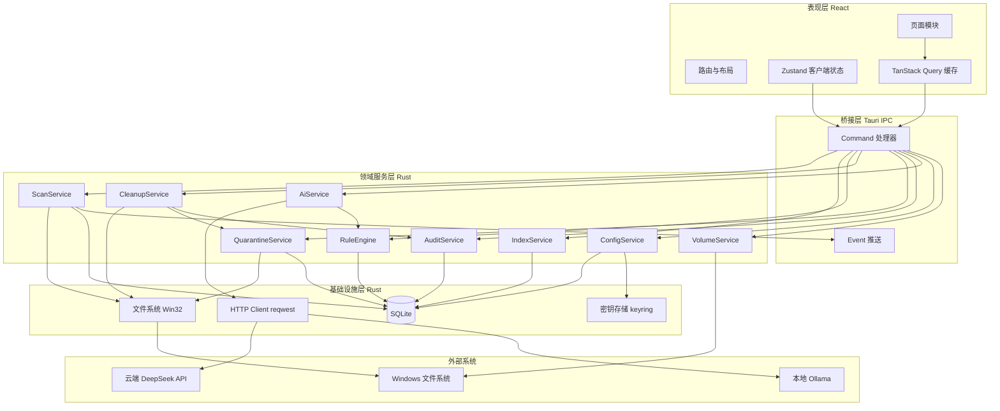
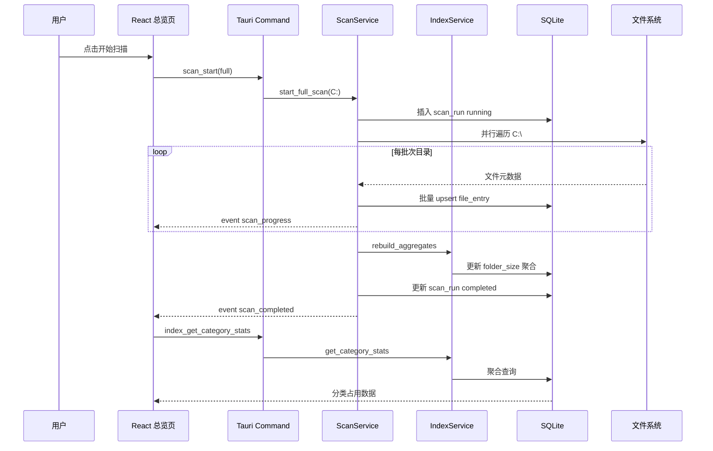
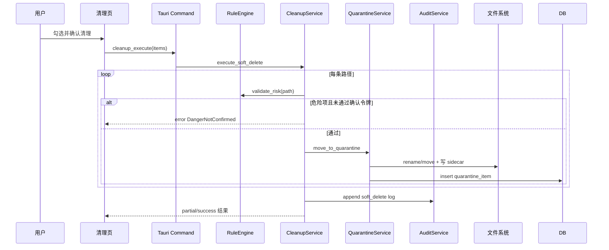
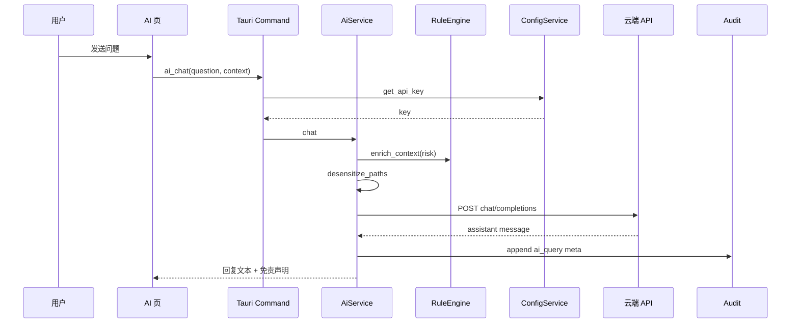
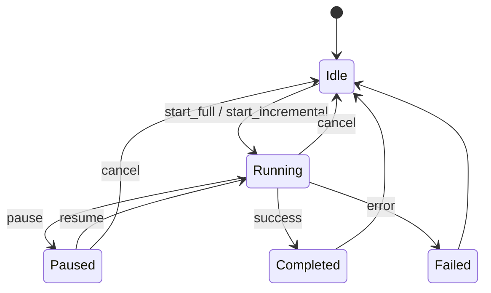
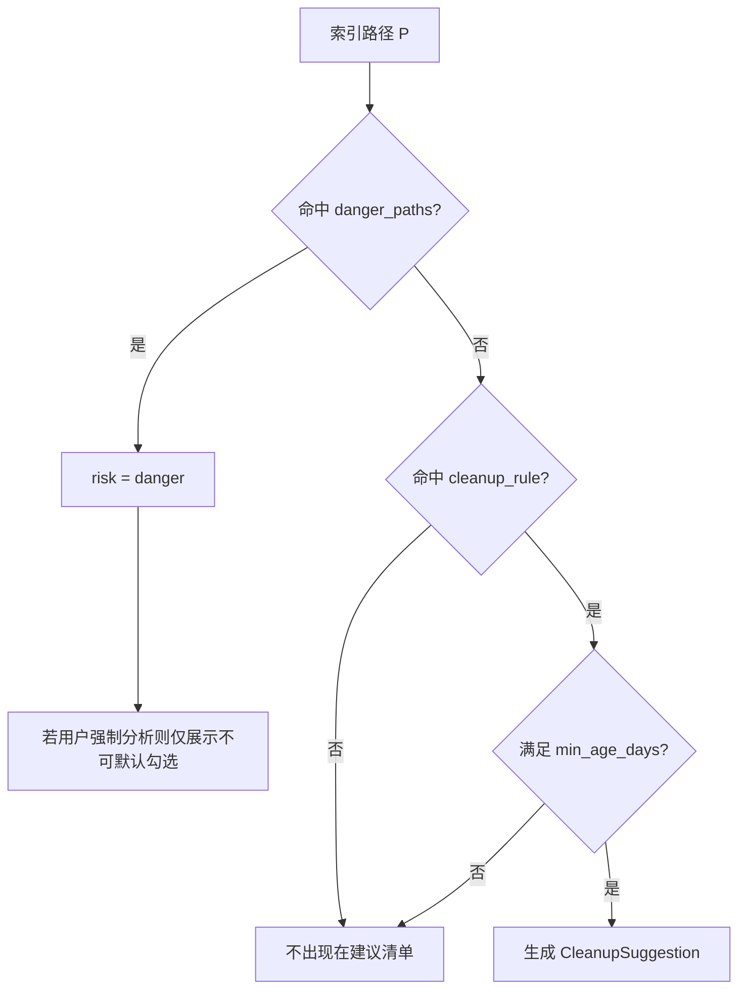
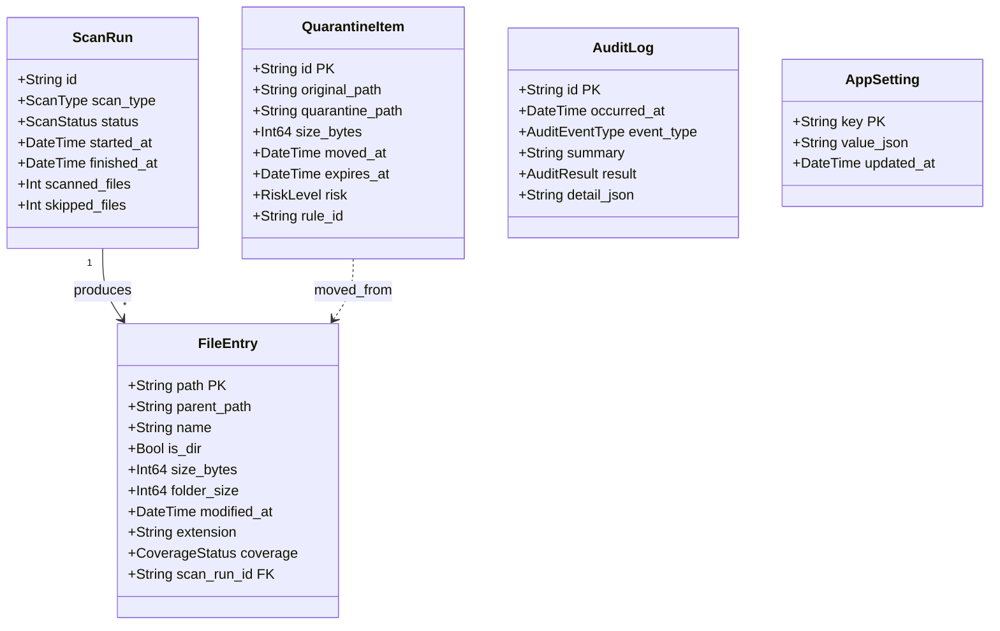
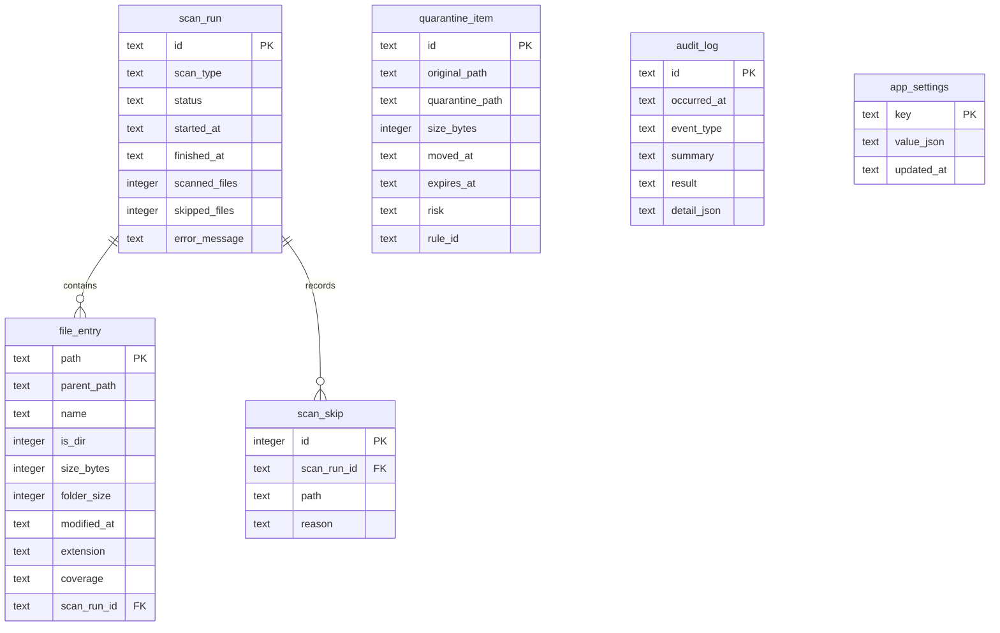

# AI 磁盘管理助手（Disk Helper）详细设计 — v1.0

> 版本：v1.0 · 状态：草稿 · 关联文档：产品概要说明书_v1.md、PRD_*.md
>
> 技术栈：Tauri 2 + React 18 + TypeScript + Rust + SQLite

---

## 1. 设计目标与定位

### 1.1 核心定位

Disk Helper v1 是一款 **Windows 本地桌面客户端**，在单机上完成 C 盘扫描、索引、空间可视化、规则驱动的安全清理、隔离区管理与云端 AI 辅助分析。产品不依赖后端服务，所有用户数据（索引、日志、配置、隔离区文件）均存储在本机 `%AppData%/DiskHelper/` 目录下。

本设计面向第一版自用交付，同时在架构上预留 **Phase 3 云端 Spring 服务**（账号、规则库同步、AI 网关）的扩展点，但 v1 不实现任何网络服务端。

### 1.2 设计原则

| 原则 | 说明 |
|------|------|
| **本地优先** | 扫描、索引、清理、隔离区、规则裁决均在 Rust 本地执行；仅 AI 问答走 HTTPS  outbound |
| **安全优先于智能** | 规则引擎决定风险等级与可否清理；AI 只读上下文、只输出文本，不触发文件操作 |
| **UI 与引擎分离** | React 仅负责展示与交互；所有文件系统与 DB 操作经 Tauri Command 进入 Rust Service 层 |
| **可测试性** | Rust 核心服务与规则引擎可脱离 UI 单测；扫描/规则可用 fixture 目录集成测试 |
| **增量演进** | 模块边界清晰，后续可抽出 `disk-helper-core` crate 供 Agent 或 Spring 侧远程调用 |
| **性能可接受** | 全量扫描后台线程 + 批量 SQLite 写入；UI 读索引不走实时 walk |
| **约定优于配置** | 第一版 C 盘固定；AI 双通道（云端 DeepSeek + 本地 Ollama 小模型）可切换 |

---

## 2. 系统架构设计

### 2.1 架构总览



**分层说明：**

- **表现层**：单页应用（SPA），7 个业务页面 + 布局壳；通过 `@tauri-apps/api/core` 的 `invoke` 调用后端，通过 `@tauri-apps/api/event` 订阅扫描进度。
- **桥接层**：Tauri 2 Command 注册于 `src-tauri/src/commands/`，统一入参校验与 `{ data, error }` 响应封装。
- **领域服务层**：无 UI 依赖，封装业务逻辑；Service 之间通过 Rust trait 或显式依赖注入（构造时传入 `AppState`）。
- **基础设施层**：SQLite（`rusqlite` + 迁移）、Win32 文件操作（`std::fs` + 必要时 `windows` crate）、HTTP、系统密钥链。

### 2.2 模块职责矩阵

| 模块 | 技术位置 | 核心职责 | 依赖 |
|------|----------|----------|------|
| **DiskOverview 页面** | `src/pages/overview/` | C 盘容量、分类聚合、扫描控制、快捷跳转 | VolumeService, ScanService, IndexService |
| **SpaceExplorer 页面** | `src/pages/explorer/` | 目录树、Treemap、Top 榜单、搜索 | IndexService, RuleEngine |
| **SafeCleanup 页面** | `src/pages/cleanup/` | 建议清单、勾选、执行软删除 | RuleEngine, CleanupService |
| **AiAnalysis 页面** | `src/pages/analysis/` | 对话 UI、上下文面板 | AiService |
| **Quarantine 页面** | `src/pages/quarantine/` | 隔离区列表、还原、永久删除 | QuarantineService |
| **AuditLog 页面** | `src/pages/audit/` | 日志筛选、导出 | AuditService |
| **Settings 页面** | `src/pages/settings/` | 配置表单、测试连接 | ConfigService |
| **ScanService** | `src-tauri/src/services/scan.rs` | 全量/增量扫描任务生命周期 | FS, SQLite, Event |
| **IndexService** | `src-tauri/src/services/index.rs` | 索引 CRUD、聚合查询、Top N | SQLite |
| **RuleEngine** | `src-tauri/src/services/rules.rs` | 内置规则匹配、风险分级、建议生成 | SQLite, 规则 JSON |
| **CleanupService** | `src-tauri/src/services/cleanup.rs` | 批量软删除编排 | QuarantineService, FS, AuditService |
| **QuarantineService** | `src-tauri/src/services/quarantine.rs` | 移入/还原/永久删除 | FS, SQLite |
| **AuditService** | `src-tauri/src/services/audit.rs` | 审计日志写入与查询 | SQLite |
| **AiService** | `src-tauri/src/services/ai.rs` | 上下文组装、脱敏、调用 LLM API | HTTP, ConfigService, RuleEngine |
| **ConfigService** | `src-tauri/src/services/config.rs` | 读写配置、API Key 加解密 | SQLite, keyring |
| **VolumeService** | `src-tauri/src/services/volume.rs` | C 盘实时容量（Win32 GetDiskFreeSpaceEx） | Win32 |

### 2.3 工程目录结构

```text
disk-helper/
├── src/                          # React 前端
│   ├── app/                      # 路由、布局、主题
│   ├── pages/                    # 7 个业务页
│   ├── components/               # 通用 UI（Treemap、RiskBadge 等）
│   ├── lib/
│   │   ├── tauri-client.ts       # invoke 封装 + 类型
│   │   └── format.ts             # 容量/时间格式化
│   └── stores/                   # Zustand（选中上下文、UI 偏好）
├── src-tauri/
│   ├── src/
│   │   ├── main.rs
│   │   ├── lib.rs
│   │   ├── state.rs              # AppState 全局状态
│   │   ├── commands/             # Tauri Command 入口
│   │   ├── services/             # 领域服务
│   │   ├── db/                   # 迁移、连接池、Repository
│   │   ├── models/               # 领域模型 / DTO
│   │   └── error.rs              # 统一错误码
│   ├── migrations/               # SQL 迁移脚本
│   └── tauri.conf.json
├── rules/
│   └── builtin-rules.v1.json     # 内置清理规则
└── docs/current/modules/disk-helper/
```

### 2.4 技术选型明细

| 类别 | 选型 | 理由 |
|------|------|------|
| 桌面壳 | **Tauri 2** | 体积小、Rust 扫盘性能、安全边界清晰 |
| 前端框架 | **React 18 + Vite + TypeScript** | 生态成熟，Treemap 等组件丰富 |
| UI 组件 | **Tailwind CSS + shadcn/ui** | 现代简洁、深色模式友好 |
| 数据请求 | **TanStack Query v5** | 缓存索引查询、扫描状态轮询 |
| 客户端状态 | **Zustand** | 跨页上下文（浏览→AI）、视图模式 |
| 图表 | **@nivo/treemap** 或 **ECharts treemap** | Treemap 可视化 |
| 路由 | **React Router v6** | 主导航 + 子页 |
| 本地 DB | **SQLite 3**（`rusqlite`） | 索引、日志、配置、隔离元数据 |
| 并行扫描 | **rayon** + **`jwalk`** | 多线程目录遍历 |
| HTTP | **reqwest**（Rust 侧） | AI API 调用，避免前端泄露 Key |
| 密钥 | **keyring** crate | API Key 存入 Windows Credential Manager |
| 配置序列化 | **serde + serde_json** | 规则、DTO |
| 日志 | **tracing + tracing-appender** | 本地 rolling file（开发/诊断） |

**第一版 AI 双通道（用户可选其一）：**

| 模式 | Provider | Endpoint | 模型 | 密钥 |
|------|----------|----------|------|------|
| **云端** | CloudDeepSeek | `https://api.deepseek.com/v1/chat/completions` | `deepseek-chat` | API Key → keyring |
| **本地** | LocalOllama | `http://127.0.0.1:11434/v1/chat/completions` | `deepseek-r1:1.5b`（默认，可配置为 `deepseek-r1:7b`） | 无需 Key |

配置项 `ai_mode`: `cloud` | `local`。Rust `AiProvider` trait 统一 `chat()` 接口；`AiService` 按模式路由。

---

## 3. 业务流程

### 3.1 业务流程图

#### 3.1.1 全量扫描与索引构建



#### 3.1.2 安全清理（软删除至隔离区）



#### 3.1.3 AI 问答



### 3.2 业务节点简述

| 节点 | 输入 | 输出 | 说明 |
|------|------|------|------|
| **scan_start** | 扫描类型 full/incremental | scan_run_id | 若已有 running 任务则拒绝；incremental 依赖最近 completed 全量 |
| **并行遍历** | 根路径 C:\ | FileEntry 批次 | `jwalk` 跳过 reparse point 循环；无权限目录标记 partial |
| **批量 upsert** | FileEntry[] | — | 事务内 500 条/批 INSERT OR REPLACE |
| **rebuild_aggregates** | — | — | 自底向上更新 folder_size（SQL 或内存后写回） |
| **get_category_stats** | — | CategoryStat[] | 按规则前缀将路径映射到六类占用 |
| **generate_suggestions** | 索引快照 | CleanupSuggestion[] | 规则引擎扫描索引命中项，非实时 walk |
| **move_to_quarantine** | 原路径 | quarantine_id | 生成 UUID 子目录 + `meta.json` sidecar |
| **desensitize_paths** | 绝对路径 | 摘要路径 | 替换 `Users\{name}` 为 `Users/{user}` 等 |
| **chat** | question + context | markdown 文本 | system prompt 注入规则约束；禁止 model 调用工具 |

---

## 4. 核心设计

### 4.1 扫描引擎

#### 4.1.1 扫描状态机



- 扫描任务在 **独立 std::thread** 中运行，通过 `AtomicBool` 控制 pause/cancel。
- 进度通过 Tauri Event `scan://progress` 推送：`{ percent, scanned_files, skipped_files, current_path }`（current_path 可选脱敏）。

#### 4.1.2 全量扫描算法

1. 锁定扫描互斥（全局仅一个 ScanWorker）。
2. 创建 `scan_run` 记录，状态 `running`。
3. 使用 `jwalk::WalkDir::new("C:\\")`：
   - `follow_links(false)` 避免 junction 死循环；
   - `skip_hidden(false)` 统计隐藏文件；
   - 并行度 = `num_cpus - 1`（上限 8）。
4. 对每个 entry 采集：`path`, `size`, `modified_at`, `is_dir`, `extension`。
5. 权限错误（`AccessDenied`）：写入 `scan_skip` 表，父目录标记 `partial`。
6. 每 500 条 batch 写入 SQLite，并 emit progress。
7. 完成后执行 **folder_size 聚合**（见 4.2）。
8. 更新 `scan_run` 为 `completed`，记录耗时与文件数。

#### 4.1.3 增量扫描算法（v1 简化版）

不依赖 USN Journal（降低 v1 复杂度），采用 **mtime + size 启发式**：

1. 读取上次 `scan_run.completed_at`。
2. 对索引中所有 **depth ≤ 2** 的目录做 shallow re-walk，比对子项 mtime/size 变化。
3. 对变化子树触发局部 re-walk，upsert 变更条目。
4. 对索引中存在但磁盘已不存在的路径做 tombstone 删除。
5. 重新计算受影响子树的 folder_size。

> **后续优化**：v1.1 可引入 `ReadDirectoryChangesW` 或 USN 提升增量效率。

#### 4.1.4 管理员扫描

- 配置 `admin_scan_enabled=true` 时，扫描线程启动前检测是否 elevated。
- 未 elevated：仅扫描用户可访问路径；UI 提示「部分系统目录未完整扫描」。
- 可选：通过 `tauri-plugin-shell` 以 `runas` 重启扫描子进程（v1 可简化为提示用户「以管理员身份重启应用」）。

### 4.2 索引与聚合

#### 4.2.1 folder_size 计算

- **文件**：`folder_size = file_size`。
- **文件夹**：`folder_size = SUM(直接子项 folder_size)`（不含父路径重复计算）。
- v1 实现：全量扫描完成后，按 `path depth DESC` 排序，逐层 UPDATE：

```sql
UPDATE file_entry SET folder_size = (
  SELECT COALESCE(SUM(folder_size), 0)
  FROM file_entry AS c
  WHERE c.parent_path = file_entry.path AND file_entry.is_dir = 1
) WHERE is_dir = 1;
```

- 文件行 `folder_size = size_bytes`。

#### 4.2.2 分类聚合（总览六类）

规则映射表（与 `builtin-rules.v1.json` 中 `category_rules` 一致）：

| 分类 | 路径前缀示例 |
|------|-------------|
| system | `C:\Windows\` |
| program | `C:\Program Files\`, `C:\Program Files (x86)\` |
| user_doc | `C:\Users\*\Documents\`, `Pictures`, `Videos` |
| cache_temp | `*\Temp\`, `*\Cache\`, `AppData\Local\Temp` |
| download | `*\Downloads\` |
| other | 其余 |

SQL 通过 CASE WHEN 前缀匹配聚合 `folder_size`（仅根下文件或按最长前缀匹配）。

#### 4.2.3 Top N 查询

```sql
-- 大文件 Top 100（scope = 某目录前缀）
SELECT path, size_bytes, modified_at, extension
FROM file_entry
WHERE is_dir = 0 AND path LIKE ? || '%'
ORDER BY size_bytes DESC
LIMIT 100;

-- 大文件夹 Top 50
SELECT path, folder_size, modified_at
FROM file_entry
WHERE is_dir = 1 AND path LIKE ? || '%' AND path != ?
ORDER BY folder_size DESC
LIMIT 50;
```

### 4.3 规则引擎

#### 4.3.1 规则模型

规则文件 `rules/builtin-rules.v1.json` 结构：

```json
{
  "version": "1.0.0",
  "category_rules": [ ... ],
  "cleanup_rules": [
    {
      "id": "win_temp",
      "name": "Windows 临时文件",
      "category": "temp",
      "risk": "safe",
      "path_globs": ["C:\\Windows\\Temp\\**"],
      "min_age_days": 7,
      "description": "系统临时文件，清理后通常可自动重建",
      "restore_hint": "可从隔离区还原；系统会重新创建临时文件"
    }
  ],
  "danger_paths": [
    "C:\\Windows\\System32\\**",
    "C:\\Windows\\SysWOW64\\**"
  ]
}
```

#### 4.3.2 匹配流程



- 匹配库：`globset` crate。
- **风险裁决仅来自规则**；AI 上下文附带 `risk` 字段，但不覆盖。

#### 4.3.3 v1 内置规则清单（首批）

| 规则 ID | 分类 | 风险 | 说明 |
|---------|------|------|------|
| win_temp | temp | safe | Windows\Temp |
| user_temp | temp | safe | AppData\Local\Temp |
| recycle_bin | recycle | safe | `$Recycle.Bin` |
| chrome_cache | browser_cache | safe | Chrome Cache |
| edge_cache | browser_cache | safe | Edge Cache |
| download_stale_90d | download_stale | caution | Downloads 下 90 天未修改 |
| npm_cache | app_cache | caution | npm-cache |
| windows_dir | other | danger | C:\Windows 非 Temp 子路径 |

### 4.4 隔离区

#### 4.4.1 目录布局

```text
{quarantine_root}/
├── 2026-06-22/
│   └── {uuid}/
│       ├── meta.json
│       └── payload/          # 原文件或目录树
│           └── ...
```

**meta.json** 示例：

```json
{
  "id": "uuid",
  "original_path": "C:\\Users\\...\\file.dat",
  "size_bytes": 123456,
  "moved_at": "2026-06-22T10:00:00",
  "expires_at": "2026-07-22T10:00:00",
  "risk": "safe",
  "rule_id": "user_temp"
}
```

#### 4.4.2 移入策略

- 单文件：`fs::rename` 到 payload；跨盘失败时用 copy + delete。
- 目录：整体 move；失败则该项标记失败不中断批次。
- 写入 `quarantine_item` 表与 meta.json 双写；以 DB 为列表主数据源。

#### 4.4.3 还原策略

1. 检查 `original_path` 是否存在同名冲突。
2. 无冲突：`rename` payload → original_path。
3. 有冲突：返回 `Conflict` 错误码，前端弹窗处理 overwrite / alternate。
4. 成功后删除隔离目录与 DB 记录。

### 4.5 AI 服务

#### 4.5.1 脱敏规则

| 模式 | 替换为 |
|------|--------|
| `C:\Users\{username}\` | `C:\Users\{user}\` |
| 长度 > 120 的路径 | 保留首尾段 + `...` |

不上传：文件内容、完整用户名、API Key。

#### 4.5.2 Prompt 结构

- **system**：角色 + 硬性约束（不 instruct 自动删除；冲突时以规则 risk 为准；回答结构：是什么/能否删/影响/恢复）。
- **user**：用户问题 + JSON 上下文块（≤20 条，每条含 desensitized_path, size, risk, rule_description）。

#### 4.5.3 请求参数

**共用：** `max_tokens`: 2048；`temperature`: 0.3；超时 cloud 30s / local 120s（小模型可能较慢）。

**云端 CloudDeepSeek：**

- Endpoint：`https://api.deepseek.com/v1/chat/completions`
- Model：`deepseek-chat`
- Authorization：`Bearer {api_key}`

**本地 LocalOllama：**

- Endpoint：`{ollama_base_url}/v1/chat/completions`（默认 `http://127.0.0.1:11434`）
- Model：默认 `deepseek-r1:1.5b`（设置项 `ollama_model` 可改）
- 连接前检测：`GET /api/tags` 确认模型已 `ollama pull`
- 失败映射：`AiOllamaUnavailable` / `AiModelNotFound`

失败映射（共用）：`AiInvalidKey` / `AiNetworkError` / `AiRateLimit` / `AiTimeout` / `AiProviderError`

### 4.6 配置与密钥

- 非敏感配置存 SQLite `app_settings`（JSON blob 或 KV）。
- **API Key** 存 Windows Credential Manager（service=`DiskHelper`, user=`ai_api_key`），SQLite 仅存 `has_api_key: bool`。
- 保存设置时：`ConfigService::save` 校验 → 写 DB → 更新 keyring → 写 audit `settings_change`（不含 Key）。

### 4.7 前端架构要点

|  Concern | 方案 |
|----------|------|
| 路由 | `/overview`, `/explorer`, `/cleanup`, `/quarantine`, `/analysis`, `/settings`, `/settings/audit` |
| 扫描进度 | 订阅 `scan://progress` + Query 轮询 `scan_get_status` |
| 跨页上下文 | Zustand `useSelectionContext`：browse/cleanup → analysis |
| Treemap | 接收当前目录子项 `{ name, path, size, nodeType }[]`，点击 emit select |
| 主题 | `next-themes` + Tailwind dark class |
| 错误展示 | 统一 `ApiError` toast + 页面 inline |

### 4.8 预留扩展点（Phase 3）

| 扩展 | 方式 |
|------|------|
| Spring 用户库 | 新增 `SyncService`，Tauri 侧仅 OAuth token；规则库 HTTP 拉取 |
| 多盘符 | `scan_target` 配置化；VolumeService 泛化 |
| 更多 AI Provider | 扩展 `AiProvider` trait 注册表 |
| Spring 云端规则库 | `SyncService` HTTP 拉取 |

---

## 5. 数模设计

### 5.1 数据模型设计



### 5.2 表设计

#### ER 图



#### 表说明

**scan_run — 扫描任务**

| 字段名 | 类型 | 约束 | 说明 |
|--------|------|------|------|
| id | TEXT | PK | UUID |
| scan_type | TEXT | NOT NULL | full / incremental |
| status | TEXT | NOT NULL | running / paused / completed / failed / cancelled |
| started_at | TEXT | NOT NULL | ISO8601 |
| finished_at | TEXT | | ISO8601 |
| scanned_files | INTEGER | DEFAULT 0 | |
| skipped_files | INTEGER | DEFAULT 0 | |
| error_message | TEXT | | 失败原因 |

**file_entry — 文件索引**

| 字段名 | 类型 | 约束 | 说明 |
|--------|------|------|------|
| path | TEXT | PK | 规范化绝对路径 |
| parent_path | TEXT | NOT NULL | 父目录 path |
| name | TEXT | NOT NULL | 末级名 |
| is_dir | INTEGER | NOT NULL | 0/1 |
| size_bytes | INTEGER | NOT NULL | 文件大小；目录为 0 |
| folder_size | INTEGER | NOT NULL | 聚合大小 |
| modified_at | TEXT | | ISO8601 |
| extension | TEXT | | 小写，无点 |
| coverage | TEXT | NOT NULL | full / partial / skipped |
| scan_run_id | TEXT | FK | 最近更新来源 |

索引：

- `idx_file_entry_parent ON file_entry(parent_path)`
- `idx_file_entry_size ON file_entry(size_bytes DESC)`（文件）
- `idx_file_entry_folder_size ON file_entry(folder_size DESC)`（目录）
- `idx_file_entry_name ON file_entry(name COLLATE NOCASE)`

**scan_skip — 跳过记录**

| 字段名 | 类型 | 约束 | 说明 |
|--------|------|------|------|
| id | INTEGER | PK AUTO | |
| scan_run_id | TEXT | FK | |
| path | TEXT | NOT NULL | |
| reason | TEXT | NOT NULL | access_denied / busy 等 |

**quarantine_item — 隔离区**

| 字段名 | 类型 | 约束 | 说明 |
|--------|------|------|------|
| id | TEXT | PK | UUID |
| original_path | TEXT | NOT NULL | |
| quarantine_path | TEXT | NOT NULL UNIQUE | |
| size_bytes | INTEGER | NOT NULL | |
| moved_at | TEXT | NOT NULL | |
| expires_at | TEXT | NOT NULL | |
| risk | TEXT | NOT NULL | safe / caution / danger |
| rule_id | TEXT | | 可空 |

**audit_log — 操作日志**

| 字段名 | 类型 | 约束 | 说明 |
|--------|------|------|------|
| id | TEXT | PK | UUID |
| occurred_at | TEXT | NOT NULL | |
| event_type | TEXT | NOT NULL | 见 PRD 枚举 |
| summary | TEXT | NOT NULL | |
| result | TEXT | NOT NULL | success / partial / failed / info |
| detail_json | TEXT | | 失败明细等 |

索引：`idx_audit_occurred ON audit_log(occurred_at DESC)`

**app_settings — 应用配置**

| 字段名 | 类型 | 约束 | 说明 |
|--------|------|------|------|
| key | TEXT | PK | 如 theme, quarantine_root |
| value_json | TEXT | NOT NULL | JSON 字符串 |
| updated_at | TEXT | NOT NULL | |

#### 本地数据目录

```text
%AppData%/DiskHelper/
├── diskhelper.db
├── quarantine/           # 默认隔离区根
├── logs/                 # tracing 日志
└── exports/              # 诊断导出临时目录
```

---

## 6. 接口设计

> 说明：v1 为本地桌面应用，**无对外 REST 服务**。本章定义两类接口：
> 1. **Tauri IPC Command**（前端 ↔ Rust，内部 API，统一响应包络）
> 2. **外部 AI HTTP API**（Rust ↔ 云端，OpenAI 兼容，非 DAS REST）

### 6.1 内部接口约定（Tauri Command）

#### 6.1.1 响应包络

借鉴 DAS REST 的 `data` / `error` 结构，便于前端统一处理：

**成功：**

```json
{
  "data": { }
}
```

**失败：**

```json
{
  "error": {
    "code": "ScanAlreadyRunning",
    "message": "扫描进行中，请稍候",
    "target": "scan"
  }
}
```

#### 6.1.2 通用错误码

| code | HTTP 类比 | 说明 |
|------|-----------|------|
| BadArgument | 400 | 参数非法 |
| NotFound | 404 | 路径/记录不存在 |
| ScanAlreadyRunning | 409 | 扫描互斥 |
| IndexNotReady | 412 | 无有效索引 |
| DangerNotConfirmed | 403 | 危险项未确认 |
| QuarantineConflict | 409 | 还原路径冲突 |
| DiskSpaceInsufficient | 507 | 隔离区空间不足 |
| AiNoApiKey | 401 | 未配置 Key |
| AiNetworkError | 502 | 网络失败 |
| InternalError | 500 | 未预期错误 |

#### 6.1.3 Command 清单

| Command | 说明 | 请求 data | 响应 data |
|---------|------|-----------|-----------|
| `volume_get_c_drive` | C 盘实时容量 | `{}` | `{ drive, total_bytes, used_bytes, free_bytes, usage_percent }` |
| `scan_start` | 开始扫描 | `{ type: "full"\|"incremental" }` | `{ scan_run_id }` |
| `scan_pause` | 暂停 | `{}` | `{ status }` |
| `scan_resume` | 继续 | `{}` | `{ status }` |
| `scan_cancel` | 取消 | `{}` | `{ status }` |
| `scan_get_status` | 扫描状态 | `{}` | `{ status, progress_percent, scanned_files, skipped_files, last_completed_at }` |
| `index_get_category_stats` | 分类占用 | `{}` | `{ categories: [{ code, size_bytes, ratio }] }` |
| `index_get_children` | 目录子节点 | `{ path, sort: "size"\|"name" }` | `{ nodes: [FileNode] }` |
| `index_search` | 路径搜索 | `{ keyword, limit }` | `{ items: [FileNode] }` |
| `index_get_top_files` | 大文件 Top | `{ scope_path, limit }` | `{ items: [FileNode] }` |
| `index_get_top_folders` | 大文件夹 Top | `{ scope_path, limit }` | `{ items: [FileNode] }` |
| `index_clear` | 清除索引 | `{ confirm: true }` | `{}` |
| `rules_get_suggestions` | 清理建议 | `{ risk_filter?, category_filter?, path_keyword? }` | `{ items: [CleanupSuggestion], releasable_bytes }` |
| `cleanup_execute` | 执行软删除 | `{ items: [{ path }], target: "quarantine"\|"recycle_bin", danger_confirm_token? }` | `{ success_count, failed: [{ path, reason }] }` |
| `quarantine_list` | 隔离区列表 | `{ status_filter?, keyword?, page, size }` | `{ items, total }` |
| `quarantine_restore` | 还原 | `{ ids: [], conflict_strategy?, alternate_path? }` | `{ restored, failed }` |
| `quarantine_purge` | 永久删除 | `{ ids: [], confirm_text }` | `{ purged_count }` |
| `ai_chat` | AI 对话 | `{ question, context_items: [ContextItem] }` | `{ message, disclaimer }` |
| `ai_test_connection` | 测试连接 | `{ api_key?, ai_mode? }` | `{ status, message, provider }` |
| `config_get` | 读取配置 | `{}` | `{ theme, ai_mode, ollama_base_url, ollama_model, quarantine_root, retention_days, ... has_api_key }` |
| `config_save` | 保存配置 | `{ ai_mode, api_key?, ollama_base_url?, ollama_model?, ... }` | `{}` |
| `audit_list` | 日志列表 | `{ event_type?, from?, to?, keyword?, page, size }` | `{ items, total }` |
| `audit_export` | 导出摘要 | `{ format: "json"\|"txt", limit }` | `{ file_path }` |
| `audit_clear` | 清空日志 | `{ confirmed: true }` | `{}` |

**FileNode DTO：**

```json
{
  "path": "C:\\Users\\{user}\\Downloads\\large.zip",
  "name": "large.zip",
  "is_dir": false,
  "size_bytes": 1073741824,
  "folder_size": 1073741824,
  "modified_at": "2026-01-01T00:00:00Z",
  "extension": "zip",
  "coverage": "full",
  "risk": "caution"
}
```

**CleanupSuggestion DTO：**

```json
{
  "path": "C:\\Users\\{user}\\AppData\\Local\\Temp\\...",
  "is_dir": true,
  "size_bytes": 2147483648,
  "risk": "safe",
  "category": "temp",
  "rule_id": "user_temp",
  "description": "...",
  "restore_hint": "..."
}
```

#### 6.1.4 Event 推送

| Event | payload |
|-------|---------|
| `scan://progress` | `{ scan_run_id, percent, scanned_files, skipped_files }` |
| `scan://completed` | `{ scan_run_id, status, scanned_files, duration_ms }` |

### 6.2 外部接口：云端 DeepSeek（OpenAI 兼容）

> Rust `CloudDeepSeekProvider` 作为客户端调用。

**请求**

```
POST https://api.deepseek.com/v1/chat/completions
Authorization: Bearer {api_key}
Content-Type: application/json
```

**Body**

```json
{
  "model": "deepseek-chat",
  "temperature": 0.3,
  "max_tokens": 2048,
  "messages": [
    { "role": "system", "content": "..." },
    { "role": "user", "content": "..." }
  ]
}
```

### 6.3 外部接口：本地 Ollama（OpenAI 兼容）

> Rust `LocalOllamaProvider` 调用本机 Ollama。默认模型 `deepseek-r1:1.5b`。

**前置：** 用户本机执行 `ollama pull deepseek-r1:1.5b` 并保持 Ollama 服务运行。

**请求**

```
POST http://127.0.0.1:11434/v1/chat/completions
Content-Type: application/json
```

**Body**

```json
{
  "model": "deepseek-r1:1.5b",
  "temperature": 0.3,
  "max_tokens": 2048,
  "messages": [
    { "role": "system", "content": "..." },
    { "role": "user", "content": "..." }
  ]
}
```

**健康检查**

```
GET http://127.0.0.1:11434/api/tags
```

响应中须包含 `deepseek-r1:1.5b`（或用户配置的 `ollama_model`）。

### 6.4 AI 失败处理（共用）

| 状态码 | 映射 error.code |
|--------|-----------------|
| 401 | AiInvalidKey |
| 429 | AiRateLimit |
| 5xx | AiProviderError |
| 超时 | AiTimeout |
| Ollama 未启动 | AiOllamaUnavailable |
| 模型未安装 | AiModelNotFound |

所有 AI 调用经 `ai_chat` / `ai_test_connection` Command 在 Rust 侧完成；API Key 不得出现在前端。

---

## 7. 非功能设计补充

### 7.1 性能

| 项 | 目标 | 手段 |
|----|------|------|
| 批量写索引 | ≥ 5000 条/秒 | 事务 batch + prepared statement |
| Treemap 渲染 | 500 节点流畅 | 虚拟化；数据来自 index_get_children |
| DB 体积 | 100 万文件约 200MB | 路径 TEXT；定期 VACUUM（手动入口可选） |

### 7.2 安全

- Tauri Capability 最小化：仅 `fs` 读写限定 scope 为 C:\ 与 AppData。
- 禁止前端直接 `fs` 操作；全部走 Command。
- 危险路径硬编码 + 规则 double-check。
- 日志与导出路径脱敏函数统一 `desensitize_path()`。

### 7.3 测试策略

| 层级 | 范围 |
|------|------|
| Rust 单元测试 | RuleEngine glob 匹配、desensitize、聚合 SQL |
| Rust 集成测试 | 临时目录 fixture 扫描 + 隔离区 roundtrip |
| 前端组件测试 | Vitest + Testing Library（RiskBadge、Treemap） |
| E2E（可选 v1.1） | Tauri WebDriver 扫描小目录 |

---

## 8. 版本与后续

| 版本 | 内容 |
|------|------|
| **v1.0** | 本文档范围：C 盘、Tauri 客户端、云端 DeepSeek + 本地 Ollama 双 AI、增量扫描简化版 |
| v1.1 | USN/DirectoryChanges 增量、流式 AI 回复 |
| v3.0 | Spring Boot 账号/规则同步；客户端 Agent 化 |

---

## 9. 文档索引

| 文档 | 路径 |
|------|------|
| 产品概要 | `产品概要说明书_v1.md` |
| 菜单 PRD | `PRD_*.md` |
| 本详细设计 | `详细设计_v1.md` |
